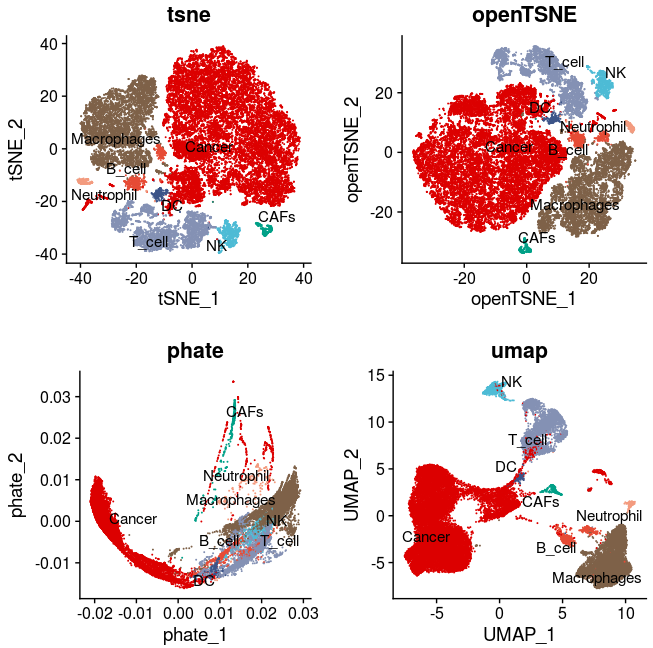
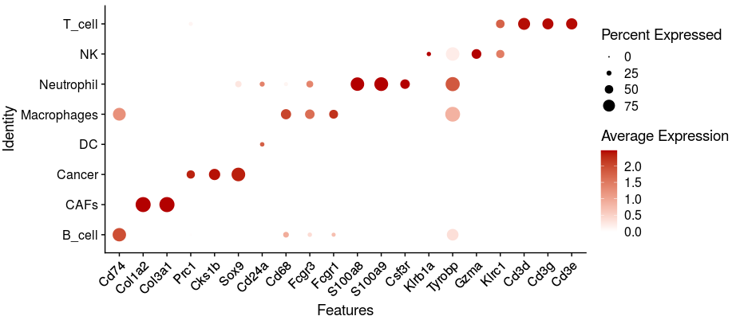

# code of data pre-analysis

In this pipeline, we showed the detail codes of scRNA-seq analyzing, including quality control, dimension reducing, population clustering, differentiation genes expression identifying, trajectory constructing, dynamics expression genes identification and pathways enrichments. To make reproducible results from our code, the raw data and processed data were totally submitted. Besides, we generate Markdowns files to record all steps. 

## 1. build the foreigner sequence in reference

~~~R
# 1. merge fq files into *S1_L001_R1_001.fastq.gz and *S1_L001_R2_001.fastq.gz
cd ./1.rawdata
mkdir -p merge_fasta/Ero1a_KO/
mkdir -p merge_fasta/Ero1a_OE/
cat ./1.rawdata/Ero1a_KO-1_FKDL210341792-1a-AK45122-AK40147/Ero1a_KO-1_FKDL210341792-1a-AK45122-AK40147_1.fq.gz \
./1.rawdata/Ero1a_KO-2_FKDL210341792-1a-AK45123-AK40147/Ero1a_KO-2_FKDL210341792-1a-AK45123-AK40147_1.fq.gz \
./1.rawdata/Ero1a_KO-3_FKDL210341792-1a-AK45124-AK40147/Ero1a_KO-3_FKDL210341792-1a-AK45124-AK40147_1.fq.gz \
./1.rawdata/Ero1a_KO-4_FKDL210341792-1a-AK45125-AK40147/Ero1a_KO-4_FKDL210341792-1a-AK45125-AK40147_1.fq.gz > ./merge_fasta/Ero1a_KO/KO_S1_L001_R1_001.fastq.gz
cat ./1.rawdata/Ero1a_OE-1_FKDL210341791-1a-AK45118-AK40147/Ero1a_OE-1_FKDL210341791-1a-AK45118-AK40147_1.fq.gz \
./1.rawdata/Ero1a_OE-2_FKDL210341791-1a-AK45119-AK40147/Ero1a_OE-2_FKDL210341791-1a-AK45119-AK40147_1.fq.gz \
./1.rawdata/Ero1a_OE-3_FKDL210341791-1a-AK45120-AK40147/Ero1a_OE-3_FKDL210341791-1a-AK45120-AK40147_1.fq.gz \
./1.rawdata/Ero1a_OE-4_FKDL210341791-1a-AK45121-AK40147/Ero1a_OE-4_FKDL210341791-1a-AK45121-AK40147_1.fq.gz > ./merge_fasta/Ero1a_OE/OE_S1_L001_R1_001.fastq.gz
cat ./1.rawdata/Ero1a_KO-1_FKDL210341792-1a-AK45122-AK40147/Ero1a_KO-1_FKDL210341792-1a-AK45122-AK40147_2.fq.gz \
./1.rawdata/Ero1a_KO-2_FKDL210341792-1a-AK45123-AK40147/Ero1a_KO-2_FKDL210341792-1a-AK45123-AK40147_2.fq.gz \
./1.rawdata/Ero1a_KO-3_FKDL210341792-1a-AK45124-AK40147/Ero1a_KO-3_FKDL210341792-1a-AK45124-AK40147_2.fq.gz \
./1.rawdata/Ero1a_KO-4_FKDL210341792-1a-AK45125-AK40147/Ero1a_KO-4_FKDL210341792-1a-AK45125-AK40147_2.fq.gz > ./merge_fasta/Ero1a_KO/KO_S1_L001_R2_001.fastq.gz
cat ./1.rawdata/Ero1a_OE-1_FKDL210341791-1a-AK45118-AK40147/Ero1a_OE-1_FKDL210341791-1a-AK45118-AK40147_2.fq.gz \
./1.rawdata/Ero1a_OE-2_FKDL210341791-1a-AK45119-AK40147/Ero1a_OE-2_FKDL210341791-1a-AK45119-AK40147_2.fq.gz \
./1.rawdata/Ero1a_OE-3_FKDL210341791-1a-AK45120-AK40147/Ero1a_OE-3_FKDL210341791-1a-AK45120-AK40147_2.fq.gz \
./1.rawdata/Ero1a_OE-4_FKDL210341791-1a-AK45121-AK40147/Ero1a_OE-4_FKDL210341791-1a-AK45121-AK40147_2.fq.gz > ./merge_fasta/Ero1a_OE/OE_S1_L001_R2_001.fastq.gz

# 2. align the scRNA-seq data
mkdir -p ./scRNA_10X/KO
cd ./scRNA_10X/KO
/mnt/data/user_data/xiangyu/programme/cellranger-5.0.1/cellranger count \
--id=KO \
--localcores 25 \
--transcriptome=/mnt/data/user_data/xiangyu/programme/genome_index/cellranger_ref_10x/mouse/refdata-gex-mm10-2020-A \
--fastqs=./1.rawdata/merge_fasta/Ero1a_KO \
--sample=KO \
--nosecondary

mkdir -p ./scRNA_10X/OE
cd ./scRNA_10X/OE
/mnt/data/user_data/xiangyu/programme/cellranger-5.0.1/cellranger count \
--id=OE \
--localcores 25 \
--transcriptome=/mnt/data/user_data/xiangyu/programme/genome_index/cellranger_ref_10x/mouse/refdata-gex-mm10-2020-A \
--fastqs=./1.rawdata/merge_fasta/Ero1a_OE \
--sample=OE \
--nosecondary
~~~

## 2. RNA velocity calculation in scRNA-seq

~~~R
# 1. decompress the barcode files.
mkdir ./scRNA_10X/velocity
gunzip ./scRNA_10X/OE/OE/outs/filtered_feature_bc_matrix/barcodes.tsv.gz
gunzip ./scRNA_10X/KO/KO/outs/filtered_feature_bc_matrix/barcodes.tsv.gz
# 2. calculate the RNA velocity.
vim velocyto1.sh
ref_gtf=/mnt/data/user_data/xiangyu/programme/genome_index/cellranger_ref_10x/mouse/refdata-gex-mm10-2020-A/genes/genes.gtf
repeat_msk=/mnt/data/user_data/xiangyu/workshop/scRNA/velocity_file/refer_file/mm10_rmsk.gtf
velocyto run -@ 25 -m $repeat_msk \
./scRNA_10X/OE/OE/outs/possorted_genome_bam.bam \
-b ./scRNA_10X/OE/OE/outs/filtered_feature_bc_matrix/barcodes.tsv \
-o ./scRNA_10X/velocity/OE $ref_gtf
velocyto run -@ 25 -m $repeat_msk \
./scRNA_10X/KO/KO/outs/possorted_genome_bam.bam \
-b ./scRNA_10X/KO/KO/outs/filtered_feature_bc_matrix/barcodes.tsv \
-o ./scRNA_10X/velocity/KO $ref_gtf
bash velocyto1.sh
# 3. compress the barcode files.
gzip ./scRNA_10X/OE/OE/outs/filtered_feature_bc_matrix/barcodes.tsv
gzip ./scRNA_10X/KO/KO/outs/filtered_feature_bc_matrix/barcodes.tsv
# 3. merge multiple .loom files.
import loompy
import os
import numpy as np
from scipy.io import mmread
files = ["./scRNA_10X/velocity/KO/possorted_genome_bam_WZ1W4.loom",
"./scRNA_10X/velocity/OE/possorted_genome_bam_ZMUR8.loom"]
loompy.combine(files, "all_merged.loom", key="Accession")
# 3. convert the loom file into seurat object.
library(velocyto.R)
ldat <- read.loom.matrices("./scRNA_10X/velocity/all_merged.loom")
emat <- ldat$spliced
nmat <- ldat$unspliced
ambiguous <- ldat$ambiguous
all_files <- list(emat,nmat,ambiguous)
all_files_ <- lapply(1:length(all_files),function(x) {
	sel_f <- all_files[[x]]
	col_sel_f <- colnames(sel_f)
	col_sel_f <- gsub("possorted_genome_bam_WZ1W4:","KO_",col_sel_f)
	col_sel_f <- gsub("possorted_genome_bam_ZMUR8:","OE_",col_sel_f)
	col_sel_f <- gsub("x","-1",col_sel_f)
	colnames(sel_f) <- col_sel_f
	return(sel_f)
	})
ldat1 <- ldat
ldat1$spliced <- all_files_[[1]]
ldat1$unspliced <- all_files_[[2]]
ldat1$ambiguous <- all_files_[[3]]
emat <- ldat1$spliced
nmat <- ldat1$unspliced
ambiguous <- ldat1$ambiguous
library(trqwe)
mcsaveRDS(nmat,"./scRNA_10X/velocity/all_merged_nmat_RNA_velocity.rds",mc.cores=20)
mcsaveRDS(emat,"./scRNA_10X/velocity/all_merged_emat_RNA_velocity.rds",mc.cores=20)
mcsaveRDS(ambiguous,"./scRNA_10X/velocity/all_merged_emat_RNA_velocity.rds",mc.cores=20)
library(Seurat)
library(SeuratWrappers)
all_scVel_seurat <- as.Seurat(x = ldat1)
mcsaveRDS(all_scVel_seurat,"./scRNA_10X/output/all_merged_all_RNA_velocity.rds",mc.cores=20)
~~~

## 3. miQC was used to quality control of each sample

~~~R

suppressPackageStartupMessages({
    library(dplyr)
    library(Seurat)
    library(Matrix)
    library(proxy)
    library(gplots)
    library(Rtsne)
    library(densityClust)
    library(irlba)
    library(monocle)
    library(plyr)
    library(DOSE)
    library(clusterProfiler)
    library(topGO)
    library(pathview)
    library(AnnotationDbi)
    library(cowplot)
    library(ggplot2)
    library(velocyto.R)
    library(trqwe)
    library(Rsamtools)
    library(GenomicFeatures)
    library(GenomicAlignments)
    library(BiocParallel)
    library(pheatmap)
    library(RColorBrewer)
    library(PoiClaClu)
    library(org.Mm.eg.db)
    library(org.Hs.eg.db)
    library(DESeq2)
    library(data.table)
    library(stringr)
    library(iTALK)
    library(nichenetr)
    library(tidyr)
    library(GenomicRanges)
    library(viridis)
    library(chromVAR)
    library(ggpubr)
    library(corrplot)
    library(SingleCellExperiment)
    library(scater)
    library(flexmix)
    library(splines)
    library(biomaRt)
    library(miQC)
    library(scales)
    library(BuenColors)
    library(PCAtools)
})
source("./programme/R_PACKAGES/my_code/MyBestFunction_scRNA.R")
source("./programme/R_PACKAGES/my_code/Pseudo_CNV_series.R")
library(future)
library(future.apply)
options(future.globals.maxSize = 300 * 1024^3)
plan("multiprocess", workers = 15)
plan()

mmu_data <- list.files(path = "./workshop/OTHERS/LLH/scRNA_10X",full.names = TRUE)
KO <- grep("KO",mmu_data,value=TRUE)
OE <- grep("OE",mmu_data,value=TRUE)
Sel_files <- c(KO,OE)
names(Sel_files) <- gsub("./workshop/OTHERS/LLH/scRNA_10X/","",Sel_files)
names <- c("KO","OE")

All_filter_miQC <- future_lapply(1:length(Sel_files),function(x) {
    tmp_path <- paste0(Sel_files[x],"/",names(Sel_files)[x],"/outs/filtered_feature_bc_matrix")
    tmp.data <- Read10X(data.dir = tmp_path)
    colnames(tmp.data) <- paste(names[x],colnames(tmp.data),sep="_")
    tmp <- CreateSeuratObject(counts = tmp.data, min.cells = 3, min.features = 200,project = names[x])
    mito.features <- grep(pattern = "^mt-", x = rownames(x = tmp), value = TRUE)
    percent.mito <- Matrix::colSums(x = GetAssayData(object = tmp, slot = "counts")[mito.features,])/Matrix::colSums(x = GetAssayData(object = tmp, slot = "counts"))
    tmp[["percent.mito"]] <- percent.mito
    sim <- as.SingleCellExperiment(tmp)
    mt_genes <- grepl("^mt-",  rownames(sim))
    feature_ctrls <- list(mito = rownames(sim)[mt_genes])
    sce <- addPerCellQC(sim, subsets = feature_ctrls)
    model2 <- mixtureModel(sce, model_type = "spline")
    plot_Model <- plotModel(sce, model2) + labs(title=names[x])
    plot_Filter <- plotFiltering(sce, model2, posterior_cutoff = 0.75) + labs(title=names[x])
    miQC.keep <- miQC.keep_info(sce, model2)
    tmp$miQC.keep <- miQC.keep[rownames(tmp[[]]),]$keep
    tmp_filter <- subset(tmp,miQC.keep=="TRUE")
    tmp_filter$group <- names[x]
    tmp_filter$sample <- names(Sel_files)[x]
    all_obj <- list(plot_Model,plot_Filter,tmp_filter)
    message(names[x]," ", names(Sel_files)[x]," "," is done")
    return(all_obj)
    })
mcsaveRDS(All_filter_miQC,"./workshop/OTHERS/LLH/scRNA_10X/output/All_filter_miQC.rds",mc.cores=20)
~~~

## 4. visualize the quality control of each sample.

~~~R

All_filter_miQC <- mcreadRDS("/mnt/data/user_data/xiangyu/workshop/OTHERS/LLH/scRNA_10X/output/All_filter_miQC.rds",mc.cores=20)
plot_Model_all <- list(All_filter_miQC[[1]][[1]],All_filter_miQC[[2]][[1]])
CombinePlots(plot_Model_all,nrow=2)
plot_Filter_all <- list(All_filter_miQC[[1]][[2]],All_filter_miQC[[2]][[2]])
CombinePlots(plot_Filter_all,nrow=2)

All_summ_plot1_1 <- lapply(1:length(All_filter_miQC),function(x) {
    plot <- VlnPlot(object = All_filter_miQC[[x]][[3]], features = c("nFeature_RNA"),ncol = 1, pt.size=0) + labs(title=paste0(names[x]," nFeature")) + NoLegend()
    return(plot)
    })
CombinePlots(All_summ_plot1_1,nrow=1)
All_summ_plot1_2 <- lapply(1:length(All_filter_miQC),function(x) {
    plot <- VlnPlot(object = All_filter_miQC[[x]][[3]], features = c("nCount_RNA"),ncol = 1, pt.size=0) + labs(title=paste0(names[x]," nCount")) + NoLegend()
    return(plot)
    })
CombinePlots(All_summ_plot1_2,nrow=1)
All_summ_plot1_3 <- lapply(1:length(All_filter_miQC),function(x) {
    plot <- VlnPlot(object = All_filter_miQC[[x]][[3]], features = c("percent.mito"),ncol = 1, pt.size=0) + labs(title=paste0(names[x]," per.mito")) + NoLegend()
    return(plot)
    })
CombinePlots(All_summ_plot1_3,nrow=1)

All_summ_plot2 <- future_lapply(1:length(All_filter_miQC),function(x) {
    plot <- FeatureScatter(object = All_filter_miQC[[x]][[3]], feature1 = "nCount_RNA", feature2 = "percent.mito",pt.size=.1) + labs(title=names[x])+ NoLegend()
    return(plot)
    })
CombinePlots(All_summ_plot2,nrow=1)
All_summ_plot3 <- future_lapply(1:length(All_filter_miQC),function(x) {
    plot <- FeatureScatter(object = All_filter_miQC[[x]][[3]], feature1 = "nCount_RNA", feature2 = "nFeature_RNA",pt.size=.1) + labs(title=names[x])+ NoLegend()
    return(plot)
    })
CombinePlots(All_summ_plot3,nrow=1)
~~~

## 5. Merge all samples and Doublet cells' removing. 

~~~R
seurat_obj <- lapply(1:length(All_filter_miQC),function(x) {
    tmp <- All_filter_miQC[[x]][[3]]
    return(tmp)
    })
ALL_MERGE_DATA <- merge(seurat_obj[[1]],seurat_obj[2:length(seurat_obj)])
table(ALL_MERGE_DATA$group)
table(ALL_MERGE_DATA$sample)

library(reticulate)
library(ReductionWrappers)
library(s2a)
ALL_MERGE_DATA_seurat <- ALL_MERGE_DATA %>%
    NormalizeData(verbose = FALSE) %>%
    FindVariableFeatures(selection.method = "vst", nfeatures = 4000) %>% 
    ScaleData(verbose = TRUE) %>% 
    RunPCA(pc.genes = ALL_MERGE_DATA_seurat@var.genes, npcs = 30, verbose = FALSE)
ALL_MERGE_DATA_seurat <- ALL_MERGE_DATA_seurat %>% 
    RunUMAP(dims = 1:20) %>% 
    RunTSNE(dims = 1:20) %>% 
    FindNeighbors(dims = 1:20) %>% 
    FindClusters(resolution = c(0.1,0.2,1)) %>%
    DoPHATE(reduction_save = "phate",dims_use = 1:20) %>% 
    DoopenTSNE(reduction_save = "openTSNE",dims_use = 1:20)
mcsaveRDS(ALL_MERGE_DATA_seurat,"/mnt/data/user_data/xiangyu/workshop/OTHERS/LLH/scRNA_10X/output/ALL_MERGE_DATA.rds",mc.cores=20)

ALL_MERGE_DATA_seurat <- mcreadRDS("/mnt/data/user_data/xiangyu/workshop/OTHERS/LLH/scRNA_10X/output/ALL_MERGE_DATA.rds",mc.cores=20)
library("DoubletFinder")
sweep.res.list_ALL_MERGE <- paramSweep_v3(ALL_MERGE_DATA_seurat, PCs = 1:20)
sweep.stats_ALL_MERGE <- summarizeSweep(sweep.res.list_ALL_MERGE, GT = FALSE)
bcmvn_ALL_MERGE <- find.pK(sweep.stats_ALL_MERGE)
annotations <- ALL_MERGE_DATA_seurat@meta.data$RNA_snn_res.1
homotypic.prop <- modelHomotypic(annotations)
nExp_poi <- round(0.075*length(colnames(x = ALL_MERGE_DATA_seurat)))  ## Assuming 7.5% doublet formation rate - tailor for your dataset
nExp_poi.adj <- round(nExp_poi*(1-homotypic.prop))
ALL_MERGE_DATA_seurat <- doubletFinder_v3(ALL_MERGE_DATA_seurat, PCs = 1:20, pN = 0.25, pK = 0.09, nExp = nExp_poi, reuse.pANN = FALSE)
ALL_MERGE_DATA_seurat <- doubletFinder_v3(ALL_MERGE_DATA_seurat, PCs = 1:20, pN = 0.25, pK = 0.09, nExp = nExp_poi.adj, reuse.pANN = "pANN_0.25_0.09_2403")
ALL_MERGE_DATA_seurat@meta.data[,"DF_hi.lo"] <- ALL_MERGE_DATA_seurat@meta.data$DF.classifications_0.25_0.09_2215
ALL_MERGE_DATA_seurat@meta.data$DF_hi.lo[which(ALL_MERGE_DATA_seurat@meta.data$DF_hi.lo == "Doublet" & ALL_MERGE_DATA_seurat@meta.data$DF.classifications_0.25_0.09_2215 == "Singlet")] <- "Doublet_lo"
ALL_MERGE_DATA_seurat@meta.data$DF_hi.lo[which(ALL_MERGE_DATA_seurat@meta.data$DF_hi.lo == "Doublet")] <- "Doublet_hi"

Idents(ALL_MERGE_DATA_seurat) <- ALL_MERGE_DATA_seurat$DF_hi.lo
table(ALL_MERGE_DATA_seurat$DF_hi.lo)
p1 <- DimPlot(object = ALL_MERGE_DATA_seurat, reduction = "tsne",group.by="DF_hi.lo",label=TRUE) +NoLegend()+labs(title="ALL_MERGE_tsne")
p3 <- DimPlot(object = ALL_MERGE_DATA_seurat, reduction = "openTSNE",group.by="DF_hi.lo",label=TRUE) +NoLegend()+labs(title="ALL_MERGE_openTSNE")
p4 <- DimPlot(object = ALL_MERGE_DATA_seurat, reduction = "phate",group.by="DF_hi.lo",label=TRUE) +NoLegend()+labs(title="ALL_MERGE_phate")
p5 <- DimPlot(object = ALL_MERGE_DATA_seurat, reduction = "pca",group.by="DF_hi.lo",label=TRUE) +NoLegend()+labs(title="ALL_MERGE_pca")
p6 <- DimPlot(object = ALL_MERGE_DATA_seurat, reduction = "umap",group.by="DF_hi.lo",label=TRUE) +NoLegend()+labs(title="ALL_MERGE_umap")
plot_grid(p1,p3,p4,p5,p6,ncol=3)

library(reticulate)
library(ReductionWrappers)
library(s2a)
Idents(ALL_MERGE_DATA_seurat) <- ALL_MERGE_DATA_seurat$DF_hi.lo
ALL_MERGE_DATA_seurat1 <- subset(ALL_MERGE_DATA_seurat,DF_hi.lo=="Singlet")
ALL_MERGE_DATA_seurat2 <- ALL_MERGE_DATA_seurat1 %>%
    NormalizeData(verbose = FALSE) %>%
    FindVariableFeatures(selection.method = "vst", nfeatures = 4000) %>% 
    ScaleData(verbose = TRUE) %>% 
    RunPCA(pc.genes = ALL_MERGE_DATA_seurat2@var.genes, npcs = 30, verbose = FALSE)
ALL_MERGE_DATA_seurat2 <- ALL_MERGE_DATA_seurat2 %>% 
    RunUMAP(dims = 1:20) %>% 
    RunTSNE(dims = 1:20) %>% 
    FindNeighbors(dims = 1:20) %>% 
    FindClusters(resolution = c(0.1,0.2,1)) %>% 
    DoopenTSNE(reduction_save = "openTSNE",dims_use = 1:20) %>% 
    DoPHATE(reduction_save = "phate",dims_use = 1:20)
mcsaveRDS(ALL_MERGE_DATA_seurat2,"/mnt/data/user_data/xiangyu/workshop/OTHERS/LLH/scRNA_10X/output/ALL_MERGE_DATA_filter.rds", mc.cores = 20)
~~~

## 6. Cell annotation.

~~~R
ALL_MERGE_DATA_harmony <- mcreadRDS("/mnt/data/user_data/xiangyu/workshop/OTHERS/LLH/scRNA_10X/output/ALL_MERGE_DATA_filter_harmony.rds", mc.cores = 20)
Fibroblast <- c("Col3a1","Cd81","Vim","Sparc")
Endothelial <- c("Cldn5")
Smooth_Muscle <- c("Acta2", "Cnn1", "Tagln")
Monocyte <- c("Cd14", "F13a1", "Ly6c2")
Macrophage <- c("Cd68","Fcgr3","Fcgr1")
Neutrophil <- c("S100a8","S100a9","Cebpb","Csf3r")
Basophil <- c("Cpa3", "Ms4a2", "Mcpt8")
DC <- c("Siglech", "Cd300c", "Klk1", "Cd24a", "Clec9a","Sirpa", "Itgam")
T <- c("Cd3d","Cd3g","Cd28","Cd3e")
NKT <- c("Nkg7", "Cxcr6","Ncam1")
NK <- c("Klrb1a", "Tyrobp", "Gzma")
B <- c("Cd79a","Cd74","Cd79b","Mzb1")
Plasma <- c("Cd27", "Slamf7")

ALL_MERGE_DATA_harmony$Cell_annotation <- as.character(ALL_MERGE_DATA_harmony$RNA_snn_res.0.2)
ALL_MERGE_DATA_harmony$Cell_annotation[which(ALL_MERGE_DATA_harmony$Cell_annotation=="0")] <- "Cancer"
ALL_MERGE_DATA_harmony$Cell_annotation[which(ALL_MERGE_DATA_harmony$Cell_annotation=="1")] <- "Macrophages"
ALL_MERGE_DATA_harmony$Cell_annotation[which(ALL_MERGE_DATA_harmony$Cell_annotation=="2")] <- "Cancer"
ALL_MERGE_DATA_harmony$Cell_annotation[which(ALL_MERGE_DATA_harmony$Cell_annotation=="3")] <- "T_cell"
ALL_MERGE_DATA_harmony$Cell_annotation[which(ALL_MERGE_DATA_harmony$Cell_annotation=="4")] <- "Cancer"
ALL_MERGE_DATA_harmony$Cell_annotation[which(ALL_MERGE_DATA_harmony$Cell_annotation=="5")] <- "Cancer"
ALL_MERGE_DATA_harmony$Cell_annotation[which(ALL_MERGE_DATA_harmony$Cell_annotation=="6")] <- "NK"
ALL_MERGE_DATA_harmony$Cell_annotation[which(ALL_MERGE_DATA_harmony$Cell_annotation=="7")] <- "B_cell"
ALL_MERGE_DATA_harmony$Cell_annotation[which(ALL_MERGE_DATA_harmony$Cell_annotation=="8")] <- "Cancer"
ALL_MERGE_DATA_harmony$Cell_annotation[which(ALL_MERGE_DATA_harmony$Cell_annotation=="9")] <- "DC"
ALL_MERGE_DATA_harmony$Cell_annotation[which(ALL_MERGE_DATA_harmony$Cell_annotation=="10")] <- "CAFs"
ALL_MERGE_DATA_harmony$Cell_annotation[which(ALL_MERGE_DATA_harmony$Cell_annotation=="11")] <- "Neutrophil"

ALL_MERGE_DATA_harmony$Cell_annotation <- factor(ALL_MERGE_DATA_harmony$Cell_annotation,levels=c("B_cell","CAFs","Cancer","DC","Macrophages","Neutrophil","NK","T_cell"))
library(paletteer)
pal <- paletteer_d("ggsci::nrc_npg")[c(1,3,8,4,9,5,2,6,10)]
p1 <- DimPlot(object = ALL_MERGE_DATA_harmony, reduction = "tsne",repel=TRUE,label=TRUE,cols= pal,group.by="Cell_annotation") +NoLegend()+labs(title="tsne")
p3 <- DimPlot(object = ALL_MERGE_DATA_harmony, reduction = "openTSNE",repel=TRUE,label=TRUE,cols= pal,group.by="Cell_annotation") +NoLegend()+labs(title="openTSNE")
p4 <- DimPlot(object = ALL_MERGE_DATA_harmony, reduction = "phate",repel=TRUE,label=TRUE,cols= pal,group.by="Cell_annotation") +NoLegend()+labs(title="phate")
p6 <- DimPlot(object = ALL_MERGE_DATA_harmony, reduction = "umap",repel=TRUE,label=TRUE,cols= pal,group.by="Cell_annotation") +NoLegend()+labs(title="umap")
plot_grid(p1,p3,p4,p6,ncol=2)
~~~

~~~R
ALL_MERGE_DATA_harmony$Cell_annotation <- factor(ALL_MERGE_DATA_harmony$Cell_annotation,levels=c("B_cell","CAFs","Cancer","DC","Macrophages","Neutrophil","NK","T_cell"))
Sel_marker <- c("Cd74",
    "Col1a2","Col3a1",
    "Prc1","Cks1b","Sox9",
    "Cd24a",
    "Cd68","Fcgr3","Fcgr1",
    "S100a8","S100a9","Csf3r",
    "Klrb1a", "Tyrobp", "Gzma","Klrc1",
    "Cd3d","Cd3g","Cd3e")
DotPlot(ALL_MERGE_DATA_harmony, features = Sel_marker, cols=c("#ffffff", "#B30000"),scale = TRUE,
    col.min = 0,col.max = 5,group.by="Cell_annotation") + RotatedAxis()
~~~

