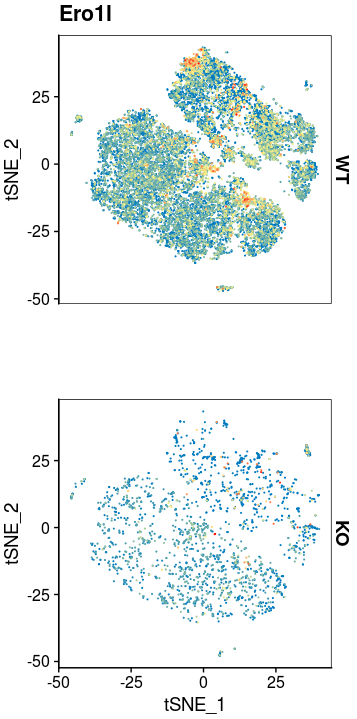
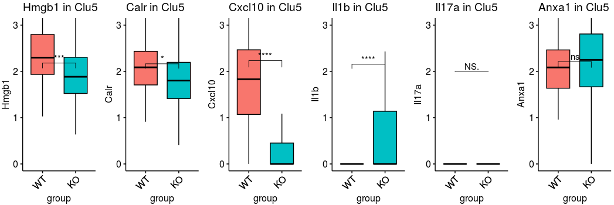
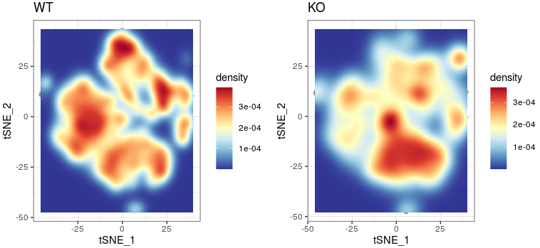
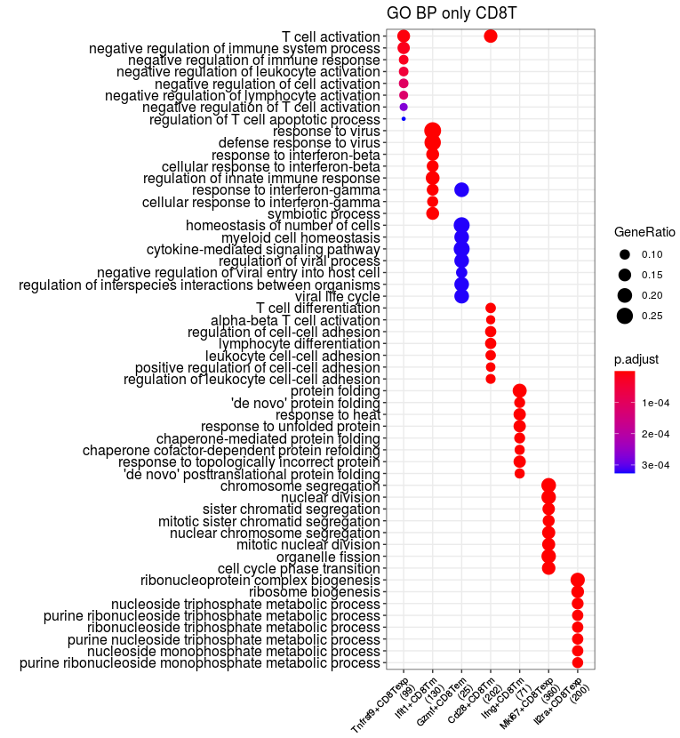
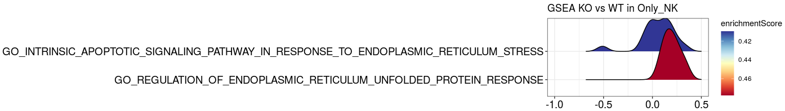
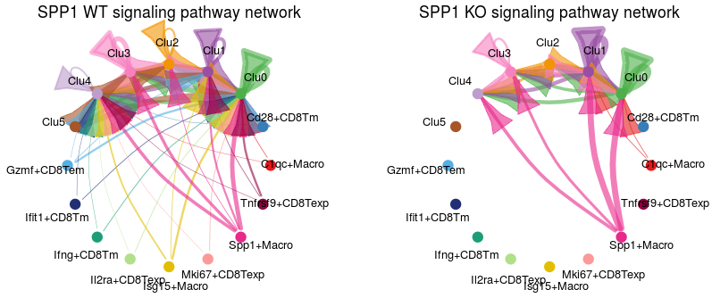

#  code of figure making

In this pipeline, we showed the detail codes of Figure making.

~~~R
options(rlib_downstream_check = FALSE)
suppressPackageStartupMessages({
    library(dplyr)
    library(Seurat)
    library(Matrix)
    library(proxy)
    library(gplots)
    library(Rtsne)
    library(densityClust)
    library(irlba)
    library(monocle)
    library(plyr)
    library(DOSE)
    library(clusterProfiler)
    library(topGO)
    library(pathview)
    library(AnnotationDbi)
    library(cowplot)
    library(ggplot2)
    library(velocyto.R)
    library(trqwe)
    library(Rsamtools)
    library(GenomicFeatures)
    library(GenomicAlignments)
    library(BiocParallel)
    library(pheatmap)
    library(RColorBrewer)
    library(PoiClaClu)
    library(org.Mm.eg.db)
    library(org.Hs.eg.db)
    library(DESeq2)
    library(data.table)
    library(stringr)
    library(iTALK)
    library(nichenetr)
    library(tidyr)
    library(GenomicRanges)
    library(viridis)
    library(chromVAR)
    library(ggpubr)
    library(corrplot)
    library(SingleCellExperiment)
    library(scater)
    library(flexmix)
    library(splines)
    library(biomaRt)
    library(miQC)
    library(scales)
    library(BuenColors)
    library(PCAtools)
})
source("/mnt/data/user_data/xiangyu/programme/R_PACKAGES/my_code/MyBestFunction_scRNA.R")
source("/mnt/data/user_data/xiangyu/programme/R_PACKAGES/my_code/Pseudo_CNV_series.R")
library(future)
library(future.apply)
options(future.globals.maxSize = 300 * 1024^3)
plan("multiprocess", workers = 15)
plan()

ALL_MERGE_DATA_harmony <- mcreadRDS("/mnt/data/user_data/xiangyu/workshop/OTHERS/LLH/scRNA_10X/output/ALL_MERGE_DATA_filter_harmony.rds", mc.cores = 20)
ALL_MERGE_DATA_harmony$group <- gsub("OE","WT",ALL_MERGE_DATA_harmony$group)
ALL_MERGE_DATA_harmony$group <- factor(ALL_MERGE_DATA_harmony$group,levels=c("WT","KO"))
ALL_MERGE_DATA_harmony$Cell_annotation <- factor(ALL_MERGE_DATA_harmony$Cell_annotation,levels=c("B_cell","CAFs","Cancer","DC","Macrophages","Neutrophil","NK","T_cell"))
library(paletteer)
library(ggsci)
ALL_MERGE_DATA_harmony$Cell_annotation <- factor(ALL_MERGE_DATA_harmony$Cell_annotation,levels=c("B_cell","CAFs","Cancer","DC","Macrophages","Neutrophil","NK","T_cell"))
pal <- paletteer_d("ggsci::nrc_npg")[c(2,3,1,4:7,9,10)]
plot <- DimPlot(object = ALL_MERGE_DATA_harmony, reduction = "tsne",repel=TRUE,label=FALSE,cols= pal,group.by="Cell_annotation") +labs(title="tsne")
ggsave("/mnt/data/user_data/xiangyu/workshop/scRNA/SCLC_LY_NFF/output/1_single_cell_landscape_all.svg", plot=plot,width = 6, height = 5,dpi=1080)
ggsave("/mnt/data/user_data/xiangyu/workshop/scRNA/SCLC_LY_NFF/output/1_single_cell_landscape_all.png", plot=plot,width = 6, height = 5,dpi=1080)
~~~

~~~R
ALL_MERGE_DATA_harmony$Cell_annotation <- factor(ALL_MERGE_DATA_harmony$Cell_annotation,levels=c("B_cell","CAFs","Cancer","DC","Macrophages","Neutrophil","NK","T_cell"))
Sel_marker <- c("Cd74",
    "Col1a2","Col3a1",
    "Prc1","Cks1b","Sox9",
    "Cd24a",
    "Cd68","Fcgr3","Fcgr1",
    "S100a8","S100a9","Csf3r",
    "Klrb1a", "Tyrobp", "Gzma","Klrc1",
    "Cd3d","Cd3g","Cd3e")
plot <- DotPlot(ALL_MERGE_DATA_harmony, features = Sel_marker, cols=c("#ffffff", "#B30000"),scale = TRUE,
    col.min = 0,col.max = 5,group.by="Cell_annotation") + RotatedAxis()
ggsave("/mnt/data/user_data/xiangyu/workshop/scRNA/SCLC_LY_NFF/output/1_single_cell_landscape_dotplot.svg", plot=plot,width = 8, height = 5,dpi=1080)
ggsave("/mnt/data/user_data/xiangyu/workshop/scRNA/SCLC_LY_NFF/output/1_single_cell_landscape_dotplot.png", plot=plot,width = 8, height = 5,dpi=1080)
~~~

~~~R
ALL_MERGE_DATA_harmony$Cell_annotation <- as.character(ALL_MERGE_DATA_harmony$Cell_annotation)
Idents(ALL_MERGE_DATA_harmony) <- ALL_MERGE_DATA_harmony$Cell_annotation
All_gsva_seura_ <- future_lapply(1:length(unique(ALL_MERGE_DATA_harmony$Cell_annotation)),function(i) {
  sel_tmp <- subset(ALL_MERGE_DATA_harmony,idents=unique(ALL_MERGE_DATA_harmony$Cell_annotation)[i])
  sel_tmp <- pseudo_bulk_seurat_mean(seurat_obj=sel_tmp,num_split=50,seed.use=1,slot="data",prefix=unique(ALL_MERGE_DATA_harmony$Cell_annotation)[i])
  metadata <- data.frame(cell_type=c(rep(unique(ALL_MERGE_DATA_harmony$Cell_annotation)[i],50)),
    row.names=colnames(sel_tmp))
  sel_gsva_seurat <- CreateSeuratObject(counts = sel_tmp,assay = 'RNA',project = 'RNA',min.cells = 0,meta.data = metadata)
  message(unique(ALL_MERGE_DATA_harmony$Cell_annotation)[i], " is done")
  return(sel_gsva_seurat)
})
All_gsva_seura <- merge(x = All_gsva_seura_[[1]], y = All_gsva_seura_[c(2:length(All_gsva_seura_))])
All_gsva_seura$cell_type <- factor(All_gsva_seura$cell_type,levels=c("B_cell","CAFs","Cancer","DC","Macrophages","Neutrophil","NK","T_cell"))
pdf("/mnt/data/user_data/xiangyu/workshop/scRNA/SCLC_LY_NFF/output/1_single_cell_landscape_heatmap.pdf")
XY_heatmap(seurat_obj=All_gsva_seura,group="cell_type",genes=Sel_marker,all_num=FALSE,new_names=NULL,labels_rot=90,
  assay_sel="RNA",color=colorRampPalette(brewer.pal(10, "RdBu"))(101),min_and_max_cut=2,show_row_names=TRUE,mark_gene=NULL,label_size=0,scale=TRUE)
dev.off()
~~~

~~~R
plot <- XY_FeaturePlot(object = ALL_MERGE_DATA_harmony, features = c("Prc1","Cks1b"),pt.size=.5,ncol=2,reduction="tsne",label=FALSE,
  cols = CustomPalette(low ="#007BBF", mid = "#FFF485",high = "#FF0000"))
ggsave("/mnt/data/user_data/xiangyu/workshop/scRNA/SCLC_LY_NFF/output/2_gene_projection.svg", plot=plot,width = 10, height = 5,dpi=1080)
ggsave("/mnt/data/user_data/xiangyu/workshop/scRNA/SCLC_LY_NFF/output/2_gene_projection.png", plot=plot,width = 10, height = 5,dpi=1080)
~~~

~~~R
plot <- XY_FeaturePlot(object = ALL_MERGE_DATA_harmony, features = c("Cd74","Col1a2","Sox9","Cd24a","Cd68",
    "S100a8","Gzma","Cd3e"),pt.size=.1,ncol=4,reduction="tsne",label=FALSE,
  cols = CustomPalette(low ="#007BBF", mid = "#FFF485",high = "#FF0000"))
ggsave("/mnt/data/user_data/xiangyu/workshop/scRNA/SCLC_LY_NFF/output/3_gene_projection.svg", plot=plot,width = 20, height = 8,dpi=1080)
ggsave("/mnt/data/user_data/xiangyu/workshop/scRNA/SCLC_LY_NFF/output/3_gene_projection.png", plot=plot,width = 20, height = 8,dpi=1080)
~~~

~~~R

ALL_MERGE_DATA_harmony_markers <- mcreadRDS(file="/mnt/data/user_data/xiangyu/workshop/OTHERS/LLH/scRNA_10X/output/ALL_MERGE_DATA_harmony_markers.rds",mc.cores=20)
col_genes <- ALL_MERGE_DATA_harmony_markers
col_genes$gene <- rownames(col_genes)
info <- col_genes[,c("cluster","gene")]
info$cluster <- as.character(info$cluster)
top_marker <- c()
number.group <- length(unique(info$cluster))
for (i in c(1:number.group)){
  y <- info$cluster
  marker <- info[with(info,y==unique(info$cluster)[i]),]
  top_marker[[i]] <- marker
  names(top_marker)[i] <- unique(info$cluster)[i]
}
gcSampl <- c()
for (i in c(1:length(top_marker))){
t <- top_marker[[i]]
symbol <- as.character(t$gene)
DD <- symbol
t$entrez <- mapIds(x = org.Mm.eg.db,
                        keys = DD,
            keytype ="SYMBOL",
            column ="ENTREZID",
            multiVals="first")
names <- na.omit(t)
entrez <- as.character(names$entrez)
gcSampl[[i]] <- entrez
names(gcSampl)[i] <- names(top_marker)[i]
print(paste(names(top_marker)[i],"is done",sep = " "))
}
HLH_T1_OFF_HIGH_KEGG <- mcreadRDS(file="/mnt/data/user_data/xiangyu/workshop/OTHERS/LLH/scRNA_10X/output/ALL_MERGE_DATA_KEGG.rds",mc.cores=20) 
enriched_KEGG <- as.data.frame(HLH_T1_OFF_HIGH_KEGG)
enriched_KEGG$Description <- as.character(enriched_KEGG$Description)
enriched_KEGG$geneID <- as.character(enriched_KEGG$geneID)
enriched_KEGG$Description <- as.character(enriched_KEGG$Description)
enriched_KEGG$GeneRatio <- as.character(enriched_KEGG$GeneRatio)
enriched_KEGG$BgRatio <- as.character(enriched_KEGG$BgRatio)
enriched_KEGG$ID <- 1:nrow(enriched_KEGG)
rownames(enriched_KEGG) <- enriched_KEGG$ID
geneSets <- as(enriched_KEGG[, "ID"], "list")
names(geneSets) <- enriched_KEGG[, "ID"]
enriched_KEGG <- new("enrichResult", result = enriched_KEGG, pvalueCutoff = 0.05,
    pAdjustMethod = "BH", gene = as.character(unlist(strsplit(enriched_KEGG$geneID, split = "/"))),
    universe = enriched_KEGG$geneID, geneSets = geneSets, organism = "Homo sapiens",
    keytype = "ENTREZID", ontology = "BP", readable = FALSE)
enriched_KEGG <- setReadable(enriched_KEGG, org.Mm.eg.db, keyType="ENTREZID")
tmp_data <- as.data.frame(enriched_KEGG)
table(tmp_data$Cluster)
subset(tmp_data,Cluster=="Cancer")$Description
T_cell <- subset(tmp_data,Cluster=="T_cell")[subset(tmp_data,Cluster=="T_cell")$Description %in% c("T cell receptor signaling pathway","Natural killer cell mediated cytotoxicity","Primary immunodeficiency",
    "Chemokine signaling pathway","Jak-STAT signaling pathway","Cytokine-cytokine receptor interaction"),]
B_cell <- subset(tmp_data,Cluster=="B_cell")[subset(tmp_data,Cluster=="B_cell")$Description %in% c("Antigen processing and presentation","Fc epsilon RI signaling pathway",
    "B cell receptor signaling pathway","Chemokine signaling pathway"),]
Neutrophil <- subset(tmp_data,Cluster=="Neutrophil")[subset(tmp_data,Cluster=="Neutrophil")$Description %in% c("Hematopoietic cell lineage"),]
CAFs <- subset(tmp_data,Cluster=="CAFs")[subset(tmp_data,Cluster=="CAFs")$Description %in% c("ECM-receptor interaction","Focal adhesion","Protein digestion and absorption","TGF-beta signaling pathway"),]
Macrophages <- subset(tmp_data,Cluster=="Macrophages")[subset(tmp_data,Cluster=="Macrophages")$Description %in% c("Lysosome","Phagosome","Cytokine-cytokine receptor interaction","Oxidative phosphorylation","Endocytosis"),]
Cancer <- subset(tmp_data,Cluster=="Cancer")[subset(tmp_data,Cluster=="Cancer")$Description %in% c("Ribosome","Cell cycle","Spliceosome","Adherens junction"),]
SE_all_clu1 <- do.call(rbind,list(B_cell,CAFs,Cancer,Macrophages,Neutrophil,T_cell))
rownames(SE_all_clu1) <- 1:nrow(SE_all_clu1)
SE_all_clu1$ID <- SE_all_clu1$Description
data_sel <- new("compareClusterResult", compareClusterResult = SE_all_clu1, geneClusters = gcSampl,fun = "enrichGO")
plot <- clusterProfiler::dotplot(data_sel,showCategory=5,includeAll=TRUE) + 
theme(axis.text.x  = element_text(angle=45, vjust=1,size=8,hjust = 1)) + labs(title = "KEGG")
~~~

~~~r
ALL_MERGE_DATA_harmony <- mcreadRDS("/mnt/data/user_data/xiangyu/workshop/OTHERS/LLH/scRNA_10X/output/ALL_MERGE_DATA_filter_harmony.rds", mc.cores = 20)
library(paletteer)
pal <- paletteer_d("ggsci::nrc_npg")[c(2,3,1,4:7,9,10)]
aa <- as.data.frame(table(ALL_MERGE_DATA_harmony$group,ALL_MERGE_DATA_harmony$Cell_annotation))
aa$Var2 <- factor(aa$Var2,levels=c("B_cell","CAFs","Cancer","DC","Macrophages","Neutrophil","NK","T_cell"))
aa <- aa[order(aa$Var2),]
aa$Var1 <- as.character(aa$Var1)
aa_all <- c()
for (i in unique(aa$Var1)){
  group_sel <- subset(aa,Var1==i)
  group_sel$sum_number <- sum(group_sel$Freq)
  group_sel$normal_ratio <- (group_sel$Freq/sum(group_sel$sum_number))*100
  group_sel$normal_ratio <- round(group_sel$normal_ratio,2)
  aa_all <- rbind(aa_all,group_sel)
}
library(ggalluvial)
aa_all$Var1 <- factor(aa_all$Var1,levels=c("WT","KO"))
aa_all <- aa_all[order(aa_all$Var1),]
plot <- ggplot(aa_all, aes(x = Var1, y = normal_ratio, fill = Var2, 
    stratum = Var2, alluvium = Var2)) +
geom_stratum() +  #代替 geom_col() 绘制堆叠柱形图
geom_flow(alpha = 0.5) +  #绘制同类别之间的连接线
theme_classic() +
scale_fill_manual(values = pal)+
labs(x = '', y = 'Relative Abundance(%)',title="percentage of subpop")
ggsave("/mnt/data/user_data/xiangyu/workshop/scRNA/SCLC_LY_NFF/output/5_single_cell_landscape_percentage.svg", plot=plot,width = 6, height = 5,dpi=1080)
~~~

~~~R
plot <- DimPlot(object = ALL_MERGE_DATA_harmony, reduction = "tsne",label=FALSE,repel=TRUE,group.by="Cell_annotation",split.by="group",cols=pal) +labs(title="tsne")
ggsave("/mnt/data/user_data/xiangyu/workshop/scRNA/SCLC_LY_NFF/output/5_single_cell_landscape_split.svg", plot=plot,width = 10, height = 5,dpi=1080)
ggsave("/mnt/data/user_data/xiangyu/workshop/scRNA/SCLC_LY_NFF/output/5_single_cell_landscape_split.png", plot=plot,width = 10, height = 5,dpi=1080)
~~~

~~~R
tsne_pos <- as.data.frame(ALL_MERGE_DATA_harmony[["tsne"]]@cell.embeddings)
tsne_pos <- tsne_pos[rownames(ALL_MERGE_DATA_harmony[[]]),]
tsne_pos$group <- ALL_MERGE_DATA_harmony$group
tsne_pos$group <- factor(tsne_pos$group,levels=c("KO","WT"))
tsne_pos <- tsne_pos[order(tsne_pos$group,decreasing=F),]
tsne_pos_KO <- subset(tsne_pos,group=="KO")
tsne_pos_WT <- subset(tsne_pos,group=="WT")
aa <- jdb_palette("brewer_celsius")
sp <- ggplot(tsne_pos_KO, aes(x=tSNE_1, y=tSNE_2)) + geom_point(colour="grey50",alpha=0.1) + theme_bw() + labs(title="KO")
sp1 <- sp + stat_density_2d(geom = "tile", aes(fill = ..density..), contour = FALSE, n =500) +
  scale_fill_gradientn(colours=alpha(aa,1))
sp <- ggplot(tsne_pos_WT, aes(x=tSNE_1, y=tSNE_2)) + geom_point(colour="grey50",alpha=0.1) + theme_bw() + labs(title="WT")
sp2 <- sp + stat_density_2d(geom = "tile", aes(fill = ..density..), contour = FALSE, n =500) +
  scale_fill_gradientn(colours=alpha(aa,1))
plot <- plot_grid(sp2,sp1,ncol=2)
ggsave("/mnt/data/user_data/xiangyu/workshop/scRNA/SCLC_LY_NFF/output/5_single_cell_landscape_split_heatmap.svg", plot=plot,width = 12, height = 5,dpi=1080)
ggsave("/mnt/data/user_data/xiangyu/workshop/scRNA/SCLC_LY_NFF/output/5_single_cell_landscape_split_heatmap.png", plot=plot,width = 12, height = 5,dpi=1080)
~~~

~~~R
Only_Cancer_harmony <- mcreadRDS("/mnt/data/user_data/xiangyu/workshop/OTHERS/LLH/scRNA_10X/output/Only_Cancer_harmony.rds", mc.cores = 20)
library(paletteer)
pal <- paletteer_d("ggsci::nrc_npg")[c(1:7,9,10)]
names(pal) <- levels(Only_Cancer_harmony$v2_Cell_annotation)
p1 <- DimPlot(object = Only_Cancer_harmony, cols=pal ,reduction = "tsne",label=FALSE,group.by="v2_Cell_annotation")+labs(title="Only_Cancer_tsne")
p2 <- DimPlot(object = Only_Cancer_harmony, cols=pal[c(2,1)] ,reduction = "tsne",label=FALSE,group.by="group")+labs(title="Only_Cancer_tsne")
plot <- plot_grid(p1,p2,ncol=2)
ggsave("/mnt/data/user_data/xiangyu/workshop/scRNA/SCLC_LY_NFF/output/6_single_cell_landscape_all.svg", plot=plot,width = 10, height = 5,dpi=1080)
ggsave("/mnt/data/user_data/xiangyu/workshop/scRNA/SCLC_LY_NFF/output/6_single_cell_landscape_all.png", plot=plot,width = 10, height = 5,dpi=1080)
~~~

~~~R
Only_Cancer_harmony <- mcreadRDS("/mnt/data/user_data/xiangyu/workshop/OTHERS/LLH/scRNA_10X/output/Only_Cancer_harmony.rds", mc.cores = 20)
library(paletteer)
pal <- paletteer_d("ggsci::nrc_npg")[c(1:7,9,10)]
names(pal) <- levels(Only_Cancer_harmony$v2_Cell_annotation)
p1 <- DimPlot(object = Only_Cancer_harmony, cols=pal ,reduction = "tsne",label=FALSE,group.by="v2_Cell_annotation")+labs(title="Only_Cancer_tsne")
p2 <- DimPlot(object = Only_Cancer_harmony, cols=pal[c(2,1)] ,reduction = "tsne",label=FALSE,group.by="group")+labs(title="Only_Cancer_tsne")
plot <- plot_grid(p1,p2,ncol=2)
ggsave("/mnt/data/user_data/xiangyu/workshop/scRNA/SCLC_LY_NFF/output/6_single_cell_landscape_all.svg", plot=plot,width = 10, height = 5,dpi=1080)
ggsave("/mnt/data/user_data/xiangyu/workshop/scRNA/SCLC_LY_NFF/output/6_single_cell_landscape_all.png", plot=plot,width = 10, height = 5,dpi=1080)
~~~

~~~R
Ref_markers <- read.csv("/mnt/data/user_data/xiangyu/workshop/OTHERS/LLH/scRNA_10X/output/colon_cancer_markers.csv")
Ref_markers$Cluster <- as.character(Ref_markers$Cluster)
Ref_markers_CC <- Ref_markers[Ref_markers$Cluster %in% grep("CC",unique(Ref_markers$Cluster),value=TRUE),]
Ref_markers_CC$Cluster <- gsub("[+]","_",Ref_markers_CC$Cluster)
Ref_markers_CC$Cluster <- gsub(" ","_",Ref_markers_CC$Cluster)
unique(Ref_markers_CC$Cluster)
Ref_markers$Gene.name <- as.character(Ref_markers$Gene.name)
markers <- list()
markers$C5 <- subset(Ref_markers_CC,Cluster=="Ogn_DcnhighCD34high_CC")$Gene.name
markers$C3 <- subset(Ref_markers_CC,Cluster=="Low_cycling_CC")$Gene.name
markers$C6 <- subset(Ref_markers_CC,Cluster=="IFN_response_CC")$Gene.name
markers$C2 <- subset(Ref_markers_CC,Cluster=="High_cycling_CC")$Gene.name
markers$C4 <- subset(Ref_markers_CC,Cluster=="H19_CC")$Gene.name
markers$C1 <- subset(Ref_markers_CC,Cluster=="Hypoxia_CC")$Gene.name
library(UCell)
Only_Cancer_harmony <- AddModuleScore_UCell(Only_Cancer_harmony, features = markers, ncores = 20)
signature.names <- paste0(names(markers), "_UCell")
plot <- VlnPlot(Only_Cancer_harmony, features = signature.names, group.by = "v2_Cell_annotation",pt.size=0,sort=TRUE)
ggsave("/mnt/data/user_data/xiangyu/workshop/scRNA/SCLC_LY_NFF/output/7_UCell_Scores_violin.svg", plot=plot,width = 18, height = 8,dpi=1080)
ggsave("/mnt/data/user_data/xiangyu/workshop/scRNA/SCLC_LY_NFF/output/7_UCell_Scores_violin.png", plot=plot,width = 18, height = 8,dpi=1080)
~~~

~~~R
plot <- XY_FeaturePlot(object = Only_Cancer_harmony, features = signature.names,ncol=3,pt.size=.1,
    reduction="tsne",label=T,cols = CustomPalette(low ="#007BBF", mid = "#FFF485",high = "#FF0000"))
ggsave("/mnt/data/user_data/xiangyu/workshop/scRNA/SCLC_LY_NFF/output/7_UCell_Scores_projection.svg", plot=plot,width = 14, height = 8,dpi=1080)
ggsave("/mnt/data/user_data/xiangyu/workshop/scRNA/SCLC_LY_NFF/output/7_UCell_Scores_projection.png", plot=plot,width = 14, height = 8,dpi=1080)
~~~

~~~R
plot <- XY_FeaturePlot(object = Only_Cancer_harmony, features = "Ero1l",ncol=1,pt.size=.1,split.by="group",
    reduction="tsne",label=T,cols = CustomPalette(low ="#007BBF", mid = "#FFF485",high = "#FF0000"))
ggsave("/mnt/data/user_data/xiangyu/workshop/scRNA/SCLC_LY_NFF/output/7_Ero1l_projection_1.svg", plot=plot,width = 7, height = 14,dpi=1080)
ggsave("/mnt/data/user_data/xiangyu/workshop/scRNA/SCLC_LY_NFF/output/7_Ero1l_projection_1.png", plot=plot,width = 7, height = 14,dpi=1080)
~~~

~~~R
plot <- XY_FeaturePlot(object = Only_Cancer_harmony, features = "Ero1l",ncol=1,pt.size=.1,split.by="group",
    reduction="tsne",label=T,cols = CustomPalette(low ="lightgrey" ,high = "#FF0000"))
ggsave("/mnt/data/user_data/xiangyu/workshop/scRNA/SCLC_LY_NFF/output/7_Ero1l_projection_2.svg", plot=plot,width = 7, height = 14,dpi=1080)
ggsave("/mnt/data/user_data/xiangyu/workshop/scRNA/SCLC_LY_NFF/output/7_Ero1l_projection_2.png", plot=plot,width = 7, height = 14,dpi=1080)
~~~

~~~R
names(pal) <- levels(Only_Cancer_harmony$v2_Cell_annotation)
plot <- DimPlot(object = Only_Cancer_harmony, reduction = "tsne",label=FALSE,repel=TRUE,group.by="v2_Cell_annotation",split.by="group",cols=pal) +labs(title="tsne")
ggsave("/mnt/data/user_data/xiangyu/workshop/scRNA/SCLC_LY_NFF/output/7_single_cell_CC_split.svg", plot=plot,width = 10, height = 5,dpi=1080)
ggsave("/mnt/data/user_data/xiangyu/workshop/scRNA/SCLC_LY_NFF/output/7_single_cell_CC_split.png", plot=plot,width = 10, height = 5,dpi=1080)
~~~

~~~R
plot <- XY_FeaturePlot(object = Only_Cancer_harmony, features = c("Ero1l","Ern1","Xbp1","Eif2ak3","Atf6","Ddit3","Casp12"),ncol=4,pt.size=.1,
    reduction="tsne",label=T,cols = CustomPalette(low ="lightgrey" ,high = "#FF0000"))
ggsave("/mnt/data/user_data/xiangyu/workshop/scRNA/SCLC_LY_NFF/output/8_gene_projection.svg", plot=plot,width = 18, height = 8,dpi=1080)
ggsave("/mnt/data/user_data/xiangyu/workshop/scRNA/SCLC_LY_NFF/output/8_gene_projection.png", plot=plot,width = 18, height = 8,dpi=1080)
~~~

~~~R
plot <- XY_FeaturePlot(object = Only_Cancer_harmony, features = c("Hmgb1","Calr","Cxcl10","Il1b","Il17a","Anxa1"),ncol=4,pt.size=.1,
    reduction="tsne",label=T,cols = CustomPalette(low ="lightgrey" ,high = "#FF0000"))
ggsave("/mnt/data/user_data/xiangyu/workshop/scRNA/SCLC_LY_NFF/output/8_gene_projection1.svg", plot=plot,width = 18, height = 8,dpi=1080)
ggsave("/mnt/data/user_data/xiangyu/workshop/scRNA/SCLC_LY_NFF/output/8_gene_projection1.png", plot=plot,width = 18, height = 8,dpi=1080)
~~~

~~~R
plot <- VlnPlot(object = Only_Cancer_harmony, features = c("Ero1l","Ern1","Xbp1","Eif2ak3","Atf6","Ddit3","Casp12"),ncol = 4, pt.size=0,group.by="v2_Cell_annotation",sort=TRUE) +NoLegend()
ggsave("/mnt/data/user_data/xiangyu/workshop/scRNA/SCLC_LY_NFF/output/8_gene_violin.svg", plot=plot,width = 18, height = 8,dpi=1080)
ggsave("/mnt/data/user_data/xiangyu/workshop/scRNA/SCLC_LY_NFF/output/8_gene_violin.png", plot=plot,width = 18, height = 8,dpi=1080)
~~~

~~~R
speci_raw <- FetchData(object = Only_Cancer_harmony, vars = c("Hmgb1","Calr","Cxcl10","Il1b","Il17a","Anxa1","group","v2_Cell_annotation"),slot="data")
library(ggpubr)
All_plot_merge <- lapply(1:length(unique(speci_raw$v2_Cell_annotation)),function(x) {
    tmp_d <- subset(speci_raw,v2_Cell_annotation==unique(speci_raw$v2_Cell_annotation)[x])
    p1 <- ggboxplot(tmp_d, x = "group", y = "Hmgb1", fill="group",
      title=paste0("Hmgb1 in ",unique(speci_raw$v2_Cell_annotation)[x]), legend = "none",outlier.shape = NA,ylim=c(0,3),notch = FALSE) +
      rotate_x_text(angle = 45)+ stat_compare_means(comparisons =list(c("WT","KO")),
        label = "p.signif", method = "wilcox.test",label.y=c(2))
    p2 <- ggboxplot(tmp_d, x = "group", y = "Calr", fill="group",
      title=paste0("Calr in ",unique(speci_raw$v2_Cell_annotation)[x]), legend = "none",outlier.shape = NA,ylim=c(0,3),notch = FALSE) +
      rotate_x_text(angle = 45)+ stat_compare_means(comparisons =list(c("WT","KO")),
        label = "p.signif", method = "wilcox.test",label.y=c(2))
    p3 <- ggboxplot(tmp_d, x = "group", y = "Cxcl10", fill="group",
      title=paste0("Cxcl10 in ",unique(speci_raw$v2_Cell_annotation)[x]), legend = "none",outlier.shape = NA,ylim=c(0,3),notch = FALSE) +
      rotate_x_text(angle = 45)+ stat_compare_means(comparisons =list(c("WT","KO")),
        label = "p.signif", method = "wilcox.test",label.y=c(2))
    p4 <- ggboxplot(tmp_d, x = "group", y = "Il1b", fill="group",
      title=paste0("Il1b in ",unique(speci_raw$v2_Cell_annotation)[x]), legend = "none",outlier.shape = NA,ylim=c(0,3),notch = FALSE) +
      rotate_x_text(angle = 45)+ stat_compare_means(comparisons =list(c("WT","KO")),
        label = "p.signif", method = "wilcox.test",label.y=c(2))
    p5 <- ggboxplot(tmp_d, x = "group", y = "Il17a", fill="group",
      title=paste0("Il17a in ",unique(speci_raw$v2_Cell_annotation)[x]), legend = "none",outlier.shape = NA,ylim=c(0,3),notch = FALSE) +
      rotate_x_text(angle = 45)+ stat_compare_means(comparisons =list(c("WT","KO")),
        label = "p.signif", method = "wilcox.test",label.y=c(2))
    p6 <- ggboxplot(tmp_d, x = "group", y = "Anxa1", fill="group",
      title=paste0("Anxa1 in ",unique(speci_raw$v2_Cell_annotation)[x]), legend = "none",outlier.shape = NA,ylim=c(0,3),notch = FALSE) +
      rotate_x_text(angle = 45)+ stat_compare_means(comparisons =list(c("WT","KO")),
        label = "p.signif", method = "wilcox.test",label.y=c(2))
    All_plot <- list(p1,p2,p3,p4,p5,p6,nrow=1)
    return(All_plot)
    })
plot <- CombinePlots(All_plot_merge[[1]],nrow=1)
ggsave("/mnt/data/user_data/xiangyu/workshop/scRNA/SCLC_LY_NFF/output/9_boxplot_1_new.svg", plot=plot,width = 10, height = 5,dpi=1080)
plot <- CombinePlots(All_plot_merge[[2]],nrow=1)
ggsave("/mnt/data/user_data/xiangyu/workshop/scRNA/SCLC_LY_NFF/output/9_boxplot_2_new.svg", plot=plot,width = 10, height = 5,dpi=1080)
plot <- CombinePlots(All_plot_merge[[3]],nrow=1)
ggsave("/mnt/data/user_data/xiangyu/workshop/scRNA/SCLC_LY_NFF/output/9_boxplot_3_new.svg", plot=plot,width = 10, height = 5,dpi=1080)
plot <- CombinePlots(All_plot_merge[[4]],nrow=1)
ggsave("/mnt/data/user_data/xiangyu/workshop/scRNA/SCLC_LY_NFF/output/9_boxplot_4_new.svg", plot=plot,width = 10, height = 5,dpi=1080)
plot <- CombinePlots(All_plot_merge[[5]],nrow=1)
ggsave("/mnt/data/user_data/xiangyu/workshop/scRNA/SCLC_LY_NFF/output/9_boxplot_5_new.svg", plot=plot,width = 10, height = 5,dpi=1080)
plot <- CombinePlots(All_plot_merge[[6]],nrow=1)
ggsave("/mnt/data/user_data/xiangyu/workshop/scRNA/SCLC_LY_NFF/output/9_boxplot_6_new.svg", plot=plot,width = 10, height = 5,dpi=1080)
~~~

~~~R
tsne_pos <- as.data.frame(Only_Cancer_harmony[["tsne"]]@cell.embeddings)
tsne_pos <- tsne_pos[rownames(Only_Cancer_harmony[[]]),]
tsne_pos$group <- Only_Cancer_harmony$group
tsne_pos$group <- factor(tsne_pos$group,levels=c("KO","WT"))
tsne_pos <- tsne_pos[order(tsne_pos$group,decreasing=F),]
tsne_pos_KO <- subset(tsne_pos,group=="KO")
tsne_pos_WT <- subset(tsne_pos,group=="WT")
aa <- jdb_palette("brewer_celsius")
sp <- ggplot(tsne_pos_KO, aes(x=tSNE_1, y=tSNE_2)) + geom_point(colour="grey50",alpha=0.1) + theme_bw() + labs(title="KO")
sp1 <- sp + stat_density_2d(geom = "tile", aes(fill = ..density..), contour = FALSE, n =500) +
  scale_fill_gradientn(colours=alpha(aa,1))
sp <- ggplot(tsne_pos_WT, aes(x=tSNE_1, y=tSNE_2)) + geom_point(colour="grey50",alpha=0.1) + theme_bw() + labs(title="WT")
sp2 <- sp + stat_density_2d(geom = "tile", aes(fill = ..density..), contour = FALSE, n =500) +
  scale_fill_gradientn(colours=alpha(aa,1))
plot <- plot_grid(sp2,sp1,ncol=2)
ggsave("/mnt/data/user_data/xiangyu/workshop/scRNA/SCLC_LY_NFF/output/10_single_cell_landscape_split_heatmap.svg", plot=plot,width = 12, height = 5,dpi=1080)
ggsave("/mnt/data/user_data/xiangyu/workshop/scRNA/SCLC_LY_NFF/output/10_single_cell_landscape_split_heatmap.png", plot=plot,width = 12, height = 5,dpi=1080)
~~~

~~~R
aa <- as.data.frame(table(Only_Cancer_harmony$group,Only_Cancer_harmony$v2_Cell_annotation))
aa <- aa[order(aa$Var2),]
aa$Var1 <- as.character(aa$Var1)
aa_all <- c()
for (i in unique(aa$Var1)){
  group_sel <- subset(aa,Var1==i)
  group_sel$sum_number <- sum(group_sel$Freq)
  group_sel$normal_ratio <- (group_sel$Freq/sum(group_sel$sum_number))*100
  group_sel$normal_ratio <- round(group_sel$normal_ratio,2)
  aa_all <- rbind(aa_all,group_sel)
}
library(ggalluvial)
aa_all$Var1 <- factor(aa_all$Var1,levels=c("WT","KO"))
aa_all <- aa_all[order(aa_all$Var1),]
p1 <- ggplot(aa_all, aes(x = Var1, y = Freq, fill = Var2, 
    stratum = Var2, alluvium = Var2)) +
geom_stratum() +  #代替 geom_col() 绘制堆叠柱形图
geom_flow(alpha = 0.5) +  #绘制同类别之间的连接线
theme_classic() +
scale_fill_manual(values = pal)+
labs(x = '', y = 'The Abundance(%)',title="Number of subpop")
p2 <- ggplot(aa_all, aes(x = Var1, y = normal_ratio, fill = Var2, 
    stratum = Var2, alluvium = Var2)) +
geom_stratum() +  #代替 geom_col() 绘制堆叠柱形图
geom_flow(alpha = 0.5) +  #绘制同类别之间的连接线
theme_classic() +
scale_fill_manual(values = pal)+
labs(x = '', y = 'Relative Abundance(%)',title="percentage of subpop")
plot <- plot_grid(p2,p1,ncol=2)
ggsave("/mnt/data/user_data/xiangyu/workshop/scRNA/SCLC_LY_NFF/output/10_single_cell_CC_percentage.svg", plot=plot,width = 6, height = 5,dpi=1080)
~~~

~~~R
library(ggpubr)
Sel_g <- c("Ero1l","Ern1","Xbp1","Eif2ak3","Atf6","Ddit3","Casp12")
sel_data <- FetchData(object = Only_Cancer_harmony, vars = c(Sel_g,"group"),slot="data")
plot <- list()
for (i in 1:length(Sel_g)){
  plot[[i]] <- ggbarplot(sel_data, x = "group", y = Sel_g[i],
    add = c("mean_se"),legend = "none",
    color = "group", fill = "group", alpha = 1,title=paste0(Sel_g[i]," in All CC"),ylim=c(0,0.75))+
  rotate_x_text(angle = 45)+ stat_compare_means(comparisons =list(c("WT","KO")),
    label = "p.signif", method = "wilcox.test",label.y=0.74)
}
plot <- CombinePlots(plot,ncol=7)
ggsave("/mnt/data/user_data/xiangyu/workshop/scRNA/SCLC_LY_NFF/output/11_barplot_expression.svg", plot=plot,width = 6, height = 5,dpi=1080)
~~~

~~~R
library(BisqueRNA)
ALL_GSEA_GMT <- read.gmt("/mnt/data/user_data/xiangyu/programme/gsea/msigdb_v7.1/msigdb_v7.1_GMTs/all_merge/msigdb.v7.1.symbols.gmt")
ALL_GSEA_GMT$ont <- as.character(ALL_GSEA_GMT$ont)
ALL_GSEA_GMT1 = ALL_GSEA_GMT %>% mutate(mouse_gene = convert_human_to_mouse_symbols(gene))
ALL_GSEA_GMT2 <- ALL_GSEA_GMT1[,c("ont","mouse_gene")]
colnames(ALL_GSEA_GMT2) <- c("ont","gene")
ALL_GSEA_GMT2 <- na.omit(ALL_GSEA_GMT2)
INTERFERON <- grep("INTERFERON",unique(ALL_GSEA_GMT2$ont),value=TRUE)
INTERFERON <- setdiff(INTERFERON,grep("NEGATIVE",INTERFERON,value=TRUE))
INTERFERON <- grep("GO",INTERFERON,value=TRUE)
INTERFERON <- grep("RECEP",INTERFERON,value=TRUE)
INTERFERON <- ALL_GSEA_GMT2[ALL_GSEA_GMT2$ont %in% INTERFERON,]
INTERFERON <- intersect(INTERFERON$gene,rownames(Only_Cancer_harmony))
speci_raw <- FetchData(object = Only_Cancer_harmony, vars = INTERFERON,slot="data")
Only_Cancer_harmony[["INTERFERON_RECEP"]] <- (rowSums(speci_raw))/length(INTERFERON)
speci_raw <- FetchData(object = Only_Cancer_harmony, vars = c("INTERFERON_RECEP","group","v2_Cell_annotation"),slot="data")
speci_raw$v2_Cell_annotation <- factor(speci_raw$v2_Cell_annotation,levels=c("Clu0","Clu1","Clu2","Clu3","Clu4","Clu5"))
speci_raw$group <- factor(speci_raw$group,levels=c("WT","KO"))
library(ggpubr)
p1 <- ggboxplot(speci_raw, x = "v2_Cell_annotation", y = "INTERFERON_RECEP", fill="v2_Cell_annotation", ylim=c(0,0.6),
  title="INTERFERON_RECEP in only CC", legend = "none",outlier.shape = NA,notch = FALSE)
p3 <- ggboxplot(speci_raw, x = "group", y = "INTERFERON_RECEP", fill="group", ylim=c(0,0.6),
  title="INTERFERON_RECEP in only CC", legend = "none",outlier.shape = NA,notch = FALSE) + 
  stat_compare_means(comparisons =list(c("WT","KO")),
    label = "p.signif", method = "wilcox.test",label.y=c(0.5))
plot <- plot_grid(p1,p3,nrow=1)
ggsave("/mnt/data/user_data/xiangyu/workshop/scRNA/SCLC_LY_NFF/output/13_boxplot_expression.svg", plot=plot,width = 6, height = 5,dpi=1080)
~~~

~~~R
Inflammatory_and_cytokine <- read.csv("/mnt/data/user_data/xiangyu/workshop/COVID19/Inflammatory_and_cytokine_genes..csv")
Inflammatory_and_cytokine$X.Inflammatory_and_cytokine_genes <- as.character(Inflammatory_and_cytokine$X.Inflammatory_and_cytokine_genes)
Inflammatory_and_cytokine = Inflammatory_and_cytokine %>% mutate(mmu_Gene = convert_human_to_mouse_symbols(X.Inflammatory_and_cytokine_genes))
Inflammatory_and_cytokine <- intersect(Inflammatory_and_cytokine$mmu_Gene,rownames(Only_Cancer_harmony))
speci_raw <- FetchData(object = Only_Cancer_harmony, vars = Inflammatory_and_cytokine,slot="data")
Only_Cancer_harmony[["Inflammatory_and_cytokine"]] <- (rowSums(speci_raw))/length(Inflammatory_and_cytokine)
plot <- XY_FeaturePlot(object = Only_Cancer_harmony, features = c("Inflammatory_and_cytokine"),
  ncol=2,pt.size=.1,reduction="tsne",label=T,cols = CustomPalette(low ="#007BBF", mid = "#FFF485",high = "#FF0000"))
ggsave("/mnt/data/user_data/xiangyu/workshop/scRNA/SCLC_LY_NFF/output/14_projection.svg", plot=plot,width = 6, height = 5,dpi=1080)
ggsave("/mnt/data/user_data/xiangyu/workshop/scRNA/SCLC_LY_NFF/output/14_projection.png", plot=plot,width = 6, height = 5,dpi=1080)
~~~

~~~R
speci_raw <- FetchData(object = Only_Cancer_harmony, vars = c("Inflammatory_and_cytokine","group","v2_Cell_annotation"),slot="data")
speci_raw$v2_Cell_annotation <- factor(speci_raw$v2_Cell_annotation,levels=c("Clu0","Clu1","Clu2","Clu3","Clu4","Clu5"))
speci_raw$group <- factor(speci_raw$group,levels=c("WT","KO"))
library(ggpubr)
p1 <- ggboxplot(speci_raw, x = "v2_Cell_annotation", y = "Inflammatory_and_cytokine", fill="v2_Cell_annotation", ylim=c(0,0.6),
  title="Inflammatory_and_cytokine in only CC", legend = "none",outlier.shape = NA,notch = FALSE)
p3 <- ggboxplot(speci_raw, x = "group", y = "Inflammatory_and_cytokine", fill="group", ylim=c(0,0.6),
  title="Inflammatory_and_cytokine in only CC", legend = "none",outlier.shape = NA,notch = FALSE) + 
  stat_compare_means(comparisons =list(c("WT","KO")),
    label = "p.signif", method = "wilcox.test",label.y=c(0.5))
plot <- plot_grid(p1,p3,nrow=1)
ggsave("/mnt/data/user_data/xiangyu/workshop/scRNA/SCLC_LY_NFF/output/14_boxplot_expression.svg", plot=plot,width = 6, height = 5,dpi=1080)
~~~

~~~R
Only_T_and_NK_harmony <- mcreadRDS("/mnt/data/user_data/xiangyu/workshop/OTHERS/LLH/scRNA_10X/output/Only_T_and_NK_harmony.rds", mc.cores = 20)
library(paletteer)
library(ggsci)
pal1 <- paletteer_d("ggsci::nrc_npg")[c(1,3,8,4,9,5,2,6,10)]
pal2 <- paletteer_d("ggsci::nrc_npg")[1:10]
pal <- c(pal1,pal2)
plot <- DimPlot(object = Only_T_and_NK_harmony, reduction = "openTSNE",label=FALSE,repel=TRUE,group.by="v2_Cell_annotation",cols=pal) +labs(title="Only_T_and_NK_openTSNE")
ggsave("/mnt/data/user_data/xiangyu/workshop/scRNA/SCLC_LY_NFF/output/15_single_cell_landscape_all.svg", plot=plot,width = 6, height = 5,dpi=1080)
ggsave("/mnt/data/user_data/xiangyu/workshop/scRNA/SCLC_LY_NFF/output/15_single_cell_landscape_all.png", plot=plot,width = 6, height = 5,dpi=1080)
~~~

~~~R
aa <- as.data.frame(table(Only_T_and_NK_harmony$group,Only_T_and_NK_harmony$v2_Cell_annotation))
aa <- aa[order(aa$Var2),]
aa$Var1 <- as.character(aa$Var1)
aa_all <- c()
for (i in unique(aa$Var1)){
  group_sel <- subset(aa,Var1==i)
  group_sel$sum_number <- sum(group_sel$Freq)
  group_sel$normal_ratio <- (group_sel$Freq/sum(group_sel$sum_number))*100
  group_sel$normal_ratio <- round(group_sel$normal_ratio,2)
  aa_all <- rbind(aa_all,group_sel)
}
library(ggalluvial)
aa_all$Var1 <- factor(aa_all$Var1,levels=c("WT","KO"))
aa_all <- aa_all[order(aa_all$Var1),]
p1 <- ggplot(aa_all, aes(x = Var1, y = Freq, fill = Var2, 
    stratum = Var2, alluvium = Var2)) +
geom_stratum() +  #代替 geom_col() 绘制堆叠柱形图
geom_flow(alpha = 0.5) +  #绘制同类别之间的连接线
theme_classic() +
scale_fill_manual(values=pal)+
labs(x = '', y = 'The Abundance(%)',title="Number of subpop")
p2 <- ggplot(aa_all, aes(x = Var1, y = normal_ratio, fill = Var2, 
    stratum = Var2, alluvium = Var2)) +
geom_stratum() +  #代替 geom_col() 绘制堆叠柱形图
geom_flow(alpha = 0.5) +  #绘制同类别之间的连接线
theme_classic() +
scale_fill_manual(values=pal)+
labs(x = '', y = 'Relative Abundance(%)',title="percentage of subpop")
plot <- plot_grid(p1,p2)
ggsave("/mnt/data/user_data/xiangyu/workshop/scRNA/SCLC_LY_NFF/output/15_single_cell_onlyT_percentage.svg", plot=plot,width = 6, height = 5,dpi=1080)

~~~

~~~R
Only_T_and_NK_harmony$v2_Cell_annotation <- as.character(Only_T_and_NK_harmony$v2_Cell_annotation)
Only_T_and_NK_harmony$v2_Cell_annotation <- gsub("[+]","_",Only_T_and_NK_harmony$v2_Cell_annotation)
Idents(Only_T_and_NK_harmony) <- Only_T_and_NK_harmony$v2_Cell_annotation
All_gsva_seura_ <- future_lapply(1:length(unique(Only_T_and_NK_harmony$v2_Cell_annotation)),function(i) {
  sel_tmp <- subset(Only_T_and_NK_harmony,idents=unique(Only_T_and_NK_harmony$v2_Cell_annotation)[i])
  sel_tmp <- pseudo_bulk_seurat_mean(seurat_obj=sel_tmp,num_split=20,seed.use=1,slot="data",prefix=unique(Only_T_and_NK_harmony$v2_Cell_annotation)[i])
  metadata <- data.frame(cell_type=c(rep(unique(Only_T_and_NK_harmony$v2_Cell_annotation)[i],20)),
    row.names=colnames(sel_tmp))
  sel_gsva_seurat <- CreateSeuratObject(counts = sel_tmp,assay = 'RNA',project = 'RNA',min.cells = 0,meta.data = metadata)
  message(unique(Only_T_and_NK_harmony$v2_Cell_annotation)[i], " is done")
  return(sel_gsva_seurat)
})
All_gsva_seura <- merge(x = All_gsva_seura_[[1]], y = All_gsva_seura_[c(2:length(All_gsva_seura_))])
All_gsva_seura$cell_type <- factor(All_gsva_seura$cell_type,levels=c("Il7r_NaiveT","Il17a_Th1","Tnfsf8_Tfh","Foxp3_Treg",
    "Cd28_CD8Tm","Ifit1_CD8Tm","Ifng_CD8Tm","Gzmf_CD8Tem",
    "Il2ra_CD8Texp","Mki67_CD8Texp","Tnfrsf9_CD8Texp",
    "Ifitm3_NKT","Il1b_NKT","Gzma_NK","Gzmc_NK","Cd79a_NK"))
NaiveT <- intersect(c("Il7r","Tcf7","Ccr7","Lef1"),rownames(All_gsva_seura))
Th1 <- intersect(c("Rora","Tnfrsf25","Ltb","Gpr183","Cdkn1a"),rownames(All_gsva_seura))
Th2 <- intersect(c("Gata3"),rownames(All_gsva_seura))
Tfh <- intersect(c("Tbc1d4","Ucp2","Batf","Nr3c1","Sesn3","Cd200","Btla","Ptpn13"),rownames(All_gsva_seura))
Treg <- intersect(c("Foxp3","Il2ra","Ctla4"),rownames(All_gsva_seura))
CD8Tm <- intersect(c("Eomes","Gzmk","Cxcr3"),rownames(All_gsva_seura))
CD8Tem <- intersect(c("Gzmb","Ccr5","Hopx","Cxcr6","Nkg7","Ctsw","Ccl5","Cst7","Prf1","Fasl","Itm2c","Chst12","Aoah","Slamf7","F2r"),rownames(All_gsva_seura))
Texp <- intersect(c("Pdcd1","Lag3","Havcr2","Tigit"),rownames(All_gsva_seura))
Tex <- intersect(c("Gzmb","Entpd1","Itgae"),rownames(All_gsva_seura))
NK <- intersect(c("Tyrobp","Cd68"),rownames(All_gsva_seura))
sel_genes <- c(NaiveT,Th1,"Il17a",Tfh,"Tnfsf8",Treg,
    CD8Tm,"Cd28","Ifit1","Ifng",
    CD8Tem,"Gzmf",Texp,"Il2ra","Mki67","Tnfrsf9", 
    NK,"Cd68","Ifitm3","Il1b","Gzma","Gzmc","Cd79a")
sel_genes <- intersect(sel_genes,rownames(All_gsva_seura))
Sel_marker <- intersect(sel_genes,rownames(All_gsva_seura))
pdf("/mnt/data/user_data/xiangyu/workshop/scRNA/SCLC_LY_NFF/output/15_single_cell_onlyT_heatmap.pdf")
XY_heatmap(seurat_obj=All_gsva_seura,group="cell_type",genes=Sel_marker,all_num=FALSE,new_names=NULL,labels_rot=90,
  assay_sel="RNA",color=colorRampPalette(brewer.pal(10, "RdBu"))(101),min_and_max_cut=2,show_row_names=TRUE,mark_gene=NULL,label_size=0,scale=TRUE)
dev.off()
~~~

~~~R
Only_CD8T_harmony <- mcreadRDS("/mnt/data/user_data/xiangyu/workshop/OTHERS/LLH/scRNA_10X/output/Only_CD8T_harmony.rds", mc.cores = 20)
plot <- DimPlot(object = Only_CD8T_harmony, reduction = "umap",label=TRUE,repel=TRUE,group.by="v2_Cell_annotation",cols=pal) +NoLegend()+labs(title="Only_T_and_NK_tsne")
ggsave("/mnt/data/user_data/xiangyu/workshop/scRNA/SCLC_LY_NFF/output/16_single_cell_CD8T.svg", plot=plot,width = 6, height = 5,dpi=1080)
ggsave("/mnt/data/user_data/xiangyu/workshop/scRNA/SCLC_LY_NFF/output/16_single_cell_CD8T.png", plot=plot,width = 6, height = 5,dpi=1080)
~~~

~~~r
plot <- DimPlot(object = Only_CD8T_harmony, reduction = "phate",label=FALSE,repel=TRUE,group.by="v2_Cell_annotation",cols=pal,split.by="group") +labs(title="Only_T_and_NK_tsne")
ggsave("/mnt/data/user_data/xiangyu/workshop/scRNA/SCLC_LY_NFF/output/16_single_cell_CD8T_split.svg", plot=plot,width = 10, height = 5,dpi=1080)
ggsave("/mnt/data/user_data/xiangyu/workshop/scRNA/SCLC_LY_NFF/output/16_single_cell_CD8T_split.png", plot=plot,width = 10, height = 5,dpi=1080)
~~~

~~~R
phate_pos <- as.data.frame(Only_CD8T_harmony[["phate"]]@cell.embeddings)
phate_pos <- phate_pos[rownames(Only_CD8T_harmony[[]]),]
phate_pos$Cell_annotation <- Only_CD8T_harmony$Cell_annotation
phate_pos$group <- Only_CD8T_harmony$group
phate_pos$group <- factor(phate_pos$group,levels=c("KO","WT"))
phate_pos <- phate_pos[order(phate_pos$group,decreasing=F),]
phate_pos_KO <- subset(phate_pos,group=="KO")
phate_pos_WT <- subset(phate_pos,group=="WT")
aa <- jdb_palette("brewer_celsius")
sp <- ggplot(phate_pos_KO, aes(x=phate_1, y=phate_2)) + geom_point(colour="grey50",alpha=0.1) + theme_bw() + labs(title="KO")
sp1 <- sp + stat_density_2d(geom = "tile", aes(fill = ..density..), contour = FALSE, n =500) +
  scale_fill_gradientn(colours=alpha(aa,1))
sp <- ggplot(phate_pos_WT, aes(x=phate_1, y=phate_2)) + geom_point(colour="grey50",alpha=0.1) + theme_bw() + labs(title="WT")
sp2 <- sp + stat_density_2d(geom = "tile", aes(fill = ..density..), contour = FALSE, n =500) +
  scale_fill_gradientn(colours=alpha(aa,1))
plot <- plot_grid(sp2,sp1,ncol=2)
ggsave("/mnt/data/user_data/xiangyu/workshop/scRNA/SCLC_LY_NFF/output/16_single_cell_CD8T_split_heatmap.svg", plot=plot,width = 12, height = 5,dpi=1080)
ggsave("/mnt/data/user_data/xiangyu/workshop/scRNA/SCLC_LY_NFF/output/16_single_cell_CD8T_split_heatmap.png", plot=plot,width = 12, height = 5,dpi=1080)
~~~

~~~R
aa <- as.data.frame(table(Only_CD8T_harmony$group,Only_CD8T_harmony$v2_Cell_annotation))
aa <- aa[order(aa$Var2),]
aa$Var1 <- as.character(aa$Var1)
aa_all <- c()
for (i in unique(aa$Var1)){
  group_sel <- subset(aa,Var1==i)
  group_sel$sum_number <- sum(group_sel$Freq)
  group_sel$normal_ratio <- (group_sel$Freq/sum(group_sel$sum_number))*100
  group_sel$normal_ratio <- round(group_sel$normal_ratio,2)
  aa_all <- rbind(aa_all,group_sel)
}
library(ggalluvial)
aa_all$Var1 <- factor(aa_all$Var1,levels=c("WT","KO"))
aa_all <- aa_all[order(aa_all$Var1),]
p1 <- ggplot(aa_all, aes(x = Var1, y = Freq, fill = Var2, 
    stratum = Var2, alluvium = Var2)) +
geom_stratum() +  #代替 geom_col() 绘制堆叠柱形图
geom_flow(alpha = 0.5) +  #绘制同类别之间的连接线
theme_classic() +
scale_fill_manual(values=pal)+
labs(x = '', y = 'The Abundance(%)',title="Number of subpop")
p2 <- ggplot(aa_all, aes(x = Var1, y = normal_ratio, fill = Var2, 
    stratum = Var2, alluvium = Var2)) +
geom_stratum() +  #代替 geom_col() 绘制堆叠柱形图
geom_flow(alpha = 0.5) +  #绘制同类别之间的连接线
theme_classic() +
scale_fill_manual(values=pal)+
labs(x = '', y = 'Relative Abundance(%)',title="percentage of subpop")
plot <- plot_grid(p1,p2)
ggsave("/mnt/data/user_data/xiangyu/workshop/scRNA/SCLC_LY_NFF/output/16_single_cell_CD8T_percentage.svg", plot=plot,width = 6, height = 5,dpi=1080)
~~~

~~~R
Only_CD8T_harmony <- mcreadRDS("/mnt/data/user_data/xiangyu/workshop/OTHERS/LLH/scRNA_10X/output/Only_CD8T_harmony.rds", mc.cores = 20)
p1 <- DimPlot(object = Only_CD8T_harmony, reduction = "phate",label=TRUE,group.by="v2_Cell_annotation",cols=pal) +NoLegend()+labs(title="phate")
p2 <- Pesudo_FeaturePlot(object = Only_CD8T_harmony, features = c("CD8T_dev"),ncol=1,pt.size=.5,reduction="phate",label=T,cols = CustomPalette(low ="#007BBF", mid = "#FFF485",high = "#FF0000")) +NoAxes()
plot <- plot_grid(p1,p2)
~~~

~~~R
annotation_row1 <- mcreadRDS(file="/mnt/data/user_data/xiangyu/workshop/OTHERS/LLH/scRNA_10X/output/Only_CD8T_peudotime_annotation_row1_all_v2.rds",mc.cores=20)
annotation_row1$Var2 <- paste0("Module_",annotation_row1$Cluster)
write.csv(annotation_row1,"/mnt/data/user_data/xiangyu/workshop/OTHERS/LLH/scRNA_10X/output/Only_CD8T_peudotime_annotation_row.csv")
heatmap_matrix <- mcreadRDS(file="/mnt/data/user_data/xiangyu/workshop/OTHERS/LLH/scRNA_10X/output/Only_CD8T_matrix.rds",mc.cores=20)
heatmap_matrix1 <- heatmap_matrix
colnames(heatmap_matrix1) <- paste0("order_",colnames(heatmap_matrix))
heatmap_matrix1 <- reshape2::melt(heatmap_matrix1)
heatmap_matrix1$Var1 <- as.character(heatmap_matrix1$Var1)
annotation_row1$Var2 <- paste0("Module_",annotation_row1$Cluster)
heatmap_matrix1$Module <- annotation_row1[heatmap_matrix1$Var1,]$Var2
heatmap_matrix1$Order <- gsub("order_","",heatmap_matrix1$Var2)
heatmap_matrix1$Order <- as.numeric(heatmap_matrix1$Order)
plot <- ggplot(heatmap_matrix1, aes(Order, value,color=Module)) +
  geom_point(alpha=0.05,size=0.01)+
  xlab("Pseudotime")+
  theme_classic() + geom_smooth(se=TRUE,size=2) + labs(title="All Modules") + facet_wrap(~Module,ncol=2)
ggsave("/mnt/data/user_data/xiangyu/workshop/scRNA/SCLC_LY_NFF/output/20_module_dynamics.svg", plot=plot,width = 9, height = 8,dpi=1080)
ggsave("/mnt/data/user_data/xiangyu/workshop/scRNA/SCLC_LY_NFF/output/20_module_dynamics.png", plot=plot,width = 9, height = 8,dpi=1080)
~~~

~~~R
library(monocle)
seuratX <- Only_CD8T_harmony
data <- as(as.matrix(seuratX@assays$RNA@data), 'sparseMatrix')
pd <- new('AnnotatedDataFrame', data = seuratX@meta.data)
fData <- data.frame(gene_short_name = row.names(data), row.names = row.names(data))
fd <- new('AnnotatedDataFrame', data = fData)
monocle_obj2 <- newCellDataSet(data,
                              phenoData = pd,
                              featureData = fd,
                              expressionFamily = uninormal())
pData(monocle_obj2)$Pseudotime <- pData(monocle_obj2)$CD8T_dev
ph <- mcreadRDS(file="/mnt/data/user_data/xiangyu/workshop/OTHERS/LLH/scRNA_10X/output/Only_CD8T_anno.rds",mc.cores=20)
heatmap_matrix <- mcreadRDS(file="/mnt/data/user_data/xiangyu/workshop/OTHERS/LLH/scRNA_10X/output/Only_CD8T_matrix.rds",mc.cores=20)
row_dist <- as.dist((1 - cor(Matrix::t(heatmap_matrix)))/2)
row_dist[is.na(row_dist)] <- 1
bks <- seq(-3.1, 3.1, by = 0.1)
hmcols <- monocle:::blue2green2red(length(bks) - 1)
diff_test_res <- mcreadRDS(file="/mnt/data/user_data/xiangyu/workshop/OTHERS/LLH/scRNA_10X/output/Only_CD8T_peudotime_genes.rds",mc.cores=20)
bin <- mcreadRDS(file="/mnt/data/user_data/xiangyu/workshop/OTHERS/LLH/scRNA_10X/output/Only_CD8T_col_bin.rds",mc.cores=20)
sig_gene_names <- row.names(subset(diff_test_res, qval < 1e-10))
length(sig_gene_names)
gene_basemean <- as.data.frame(rowMeans(data))
colnames(gene_basemean) <- "Means"
mean(as.numeric(as.character(gene_basemean$Means)))
remind_genes <- rownames(gene_basemean)[which(as.numeric(as.character(gene_basemean$Means))>mean(as.numeric(as.character(gene_basemean$Means))))]
sig_gene_names <- intersect(sig_gene_names,remind_genes)
cds_subset <- monocle_obj2[sig_gene_names,]
annotation_row <- data.frame(Cluster = factor(cutree(ph$tree_row,6)))
annotation_row$gene <- rownames(annotation_row)
annotation_row <- annotation_row[rownames(heatmap_matrix),]
annotation_row1 <- do.call(rbind,list(subset(annotation_row,Cluster==5),
  subset(annotation_row,Cluster==4),
  subset(annotation_row,Cluster==1),
  subset(annotation_row,Cluster==3),
  subset(annotation_row,Cluster==6),
  subset(annotation_row,Cluster==2)))
annotation_row1$Cluster2 <- as.numeric(as.character(annotation_row1$Cluster))
annotation_row1$Cluster2[which(annotation_row1$Cluster==5)] <- 1
annotation_row1$Cluster2[which(annotation_row1$Cluster==4)] <- 1
annotation_row1$Cluster2[which(annotation_row1$Cluster==1)] <- 2
annotation_row1$Cluster2[which(annotation_row1$Cluster==3)] <- 2
annotation_row1$Cluster2[which(annotation_row1$Cluster==6)] <- 3
annotation_row1$Cluster2[which(annotation_row1$Cluster==2 )] <- 4
annotation_row1$Cluster <- as.numeric(as.character(annotation_row1$Cluster2))
annotation_row1 <- data.frame(Cluster=as.character(annotation_row1$Cluster),row.names=rownames(annotation_row1))
order <- as.data.frame(table(annotation_row1$Cluster))
library(pheatmap)
ph_res <- pheatmap(heatmap_matrix[,], useRaster = T, cluster_cols = FALSE,
    cluster_rows = F, show_rownames = FALSE,
    show_colnames = F, clustering_distance_rows = row_dist,
    clustering_method = NULL, cutree_rows = 0,gaps_row =c(order$Freq[1],order$Freq[1]+order$Freq[2],
        order$Freq[1]+order$Freq[2]+order$Freq[3],order$Freq[1]+order$Freq[2]+order$Freq[3]+order$Freq[4]),
    annotation_row = annotation_row1, annotation_col = bin,
    treeheight_row = 20, breaks = bks, fontsize = 6, color = hmcols,
    border_color = NA, silent = TRUE, filename = NA)
pdf(file="/mnt/data/user_data/xiangyu/workshop/OTHERS/LLH/scRNA_10X/output/20_modules_dynamics.pdf")
ph_res
dev.off()
~~~

~~~R
All_genes_m <- mcreadRDS(file="/mnt/data/user_data/xiangyu/workshop/OTHERS/LLH/scRNA_10X/output/Only_CD8T_All_genes_m_normalised.rds",mc.cores=20)
All_genes_m <- as.data.frame(All_genes_m)
Sel_g <- c("Lag3","Havcr2","Pdcd1","Gzmb","Entpd1","Itgae")
sel_data <- All_genes_m[Sel_g,]
bin <- mcreadRDS(file="/mnt/data/user_data/xiangyu/workshop/OTHERS/LLH/scRNA_10X/output/Only_CD8T_col_bin.rds",mc.cores=20)
bin$order <- 1:nrow(bin)
colnames(sel_data) <- bin$order
sel_data <- as.data.frame(t(sel_data))
sel_data$group <- bin$Cell_anno
sel_data$order <- 1:nrow(sel_data)
library(BuenColors)
aa <- jdb_palette("brewer_spectra",type = "continuous")[length(jdb_palette("brewer_spectra",type = "continuous")):1]
All_plot <- future_lapply(1:length(Sel_g),function(x) {
  tmp_da <- sel_data[,c("group","order",Sel_g[x])]
  colnames(tmp_da) <- c("group","order","tmp")
  plot <- ggplot(tmp_da, aes(order, tmp,color=group)) +
  geom_point(alpha=0,size=0) +
  geom_rug(alpha = 0.8, position = "jitter",sides="b")+ xlab("Pseudotime")+
  theme_classic() + geom_smooth(colour = "orange",se=TRUE) +NoLegend()+ labs(title=Sel_g[x])
  return(plot)
  })
plot <- CombinePlots(plots = All_plot,ncol=6)
ggsave("/mnt/data/user_data/xiangyu/workshop/scRNA/SCLC_LY_NFF/output/21_exhuasted_markers_expression.svg", plot=plot,width = 10, height = 5,dpi=1080)
ggsave("/mnt/data/user_data/xiangyu/workshop/scRNA/SCLC_LY_NFF/output/21_exhuasted_markers_expression.png", plot=plot,width = 10, height = 5,dpi=1080)
~~~

~~~R
HLH_T1_OFF_HIGH_GO <- mcreadRDS(file="/mnt/data/user_data/xiangyu/workshop/OTHERS/LLH/scRNA_10X/output/Only_CD8T_peudotime_annotation_GO.rds",mc.cores=20) 
HLH_T1_OFF_HIGH_KEGG <- mcreadRDS(file="/mnt/data/user_data/xiangyu/workshop/OTHERS/LLH/scRNA_10X/output/Only_CD8T_peudotime_annotation_KEGG.rds",mc.cores=20) 
plot <- clusterProfiler::dotplot(HLH_T1_OFF_HIGH_KEGG,showCategory=20,includeAll=TRUE) + 
  theme(axis.text.x  = element_text(angle=45, vjust=1,size=8,hjust = 1)) + labs(title = "KEGG")
ggsave("/mnt/data/user_data/xiangyu/workshop/scRNA/SCLC_LY_NFF/output/22_KEGG.svg", plot=plot,width = 13, height = 13,dpi=1080)
~~~

~~~R
plot <- clusterProfiler::dotplot(HLH_T1_OFF_HIGH_GO,showCategory=15,includeAll=FALSE) + 
  theme(axis.text.x  = element_text(angle=45, vjust=1,size=8,hjust = 1)) + labs(title = "GO BP")
ggsave("/mnt/data/user_data/xiangyu/workshop/scRNA/SCLC_LY_NFF/output/22_GO_BP.svg", plot=plot,width = 13, height = 13,dpi=1080)
~~~

~~~R
Cd28_CD8Tm_KO_vs_WT <- mcreadRDS("/mnt/data/user_data/xiangyu/workshop/OTHERS/LLH/scRNA_10X/output/Cd28_CD8Tm_KO_vs_WT.rds")
Only_Cd28_CD8Tm_KO_vs_WT <- Cd28_CD8Tm_KO_vs_WT[order(Cd28_CD8Tm_KO_vs_WT$avg_logFC,decreasing=TRUE),]
Only_Cd28_CD8Tm_KO_vs_WT_genelist <- Only_Cd28_CD8Tm_KO_vs_WT$avg_logFC
names(Only_Cd28_CD8Tm_KO_vs_WT_genelist) <- rownames(Only_Cd28_CD8Tm_KO_vs_WT)
GSEA_Cd28_CD8Tm_KO_vs_WT <- mcreadRDS("/mnt/data/user_data/xiangyu/workshop/OTHERS/LLH/scRNA_10X/output/Only_Cd28_CD8Tm_KO_vs_WT_GSEA.rds")
GSEA_df <- as.data.frame(GSEA_Cd28_CD8Tm_KO_vs_WT)
ER_STRESS_df <- GSEA_df[GSEA_df$ID %in% c("GO_CD8_POSITIVE_ALPHA_BETA_T_CELL_ACTIVATION",
    "GO_CD8_POSITIVE_ALPHA_BETA_T_CELL_DIFFERENTIATION","GO_LYMPHOCYTE_COSTIMULATION","GO_INTERFERON_GAMMA_PRODUCTION","GSE9650_EFFECTOR_VS_EXHAUSTED_CD8_TCELL_UP",
    "GO_RESPONSE_TO_ENDOPLASMIC_RETICULUM_STRESS", "REACTOME_PROGRAMMED_CELL_DEATH","REACTOME_TRIF_MEDIATED_PROGRAMMED_CELL_DEATH",
    "GO_PROGRAMMED_CELL_DEATH_IN_RESPONSE_TO_REACTIVE_OXYGEN_SPECIES","GSE9650_EFFECTOR_VS_EXHAUSTED_CD8_TCELL_DN","GSE9650_EXHAUSTED_VS_MEMORY_CD8_TCELL_UP"),]
ER_STRESS_df$Description[which(ER_STRESS_df$Description=="GO_NEGATIVE_REGULATION_OF_RESPONSE_TO_ENDOPLASMIC_RETICULUM_STRESS")] <- "GO_NEGATIVE_REG_RESPONSE_TO_ER_STRESS"
ER_STRESS_df$Description[which(ER_STRESS_df$Description=="GO_RESPONSE_TO_ENDOPLASMIC_RETICULUM_STRESS")] <- "GO_RESPONSE_TO_ER_STRESS"
ER_STRESS_df[,c("Description","core_enrichment")]
ER_STRESS_df$ID <- 1:nrow(ER_STRESS_df)
rownames(ER_STRESS_df) <- ER_STRESS_df$ID
geneSets <- as(ER_STRESS_df[, "ID"], "list")
names(geneSets) <- ER_STRESS_df[, "ID"]
rownames(ER_STRESS_df) <- ER_STRESS_df$ID
gsea_tmp <- new("gseaResult", result = ER_STRESS_df, geneSets = geneSets, geneList = Only_Cd28_CD8Tm_KO_vs_WT_genelist,
        params = list(pvalueCutoff = 1, nPerm = 1000,
        pAdjustMethod = "BH", exponent = 1, minGSSize = 5,
        maxGSSize = 500), readable = FALSE)
gsea_tmp@organism <- "UNKNOWN"
gsea_tmp@setType <- "UNKNOWN"
gsea_tmp@keytype <- "UNKNOWN"
require(viridis)
aa <- jdb_palette("brewer_celsius",type = "continuous")[(length(jdb_palette("brewer_celsius",type = "continuous"))/2):(length(jdb_palette("brewer_celsius",type = "continuous")))]
aa <- jdb_palette("brewer_celsius",type = "continuous")
library(ggplot2)
tmp_files <- XY_ridgeplot.gseaResult(gsea_tmp,fill="enrichmentScore", core_enrichment = TRUE)
plot <- ggplot(tmp_files, aes_string(x="value", y="category", fill="enrichmentScore")) + ggridges ::geom_density_ridges() +
    scale_fill_gradientn(name = "enrichmentScore", colors=aa, guide=guide_colorbar(reverse=TRUE)) + xlim(-1,1)+
    xlab(NULL) + ylab(NULL) +  theme_dose() + labs(title="GSEA KO vs WT in only Cd28_CD8Tm")
ggsave("/mnt/data/user_data/xiangyu/workshop/scRNA/SCLC_LY_NFF/output/23_GSEA_results.svg", plot=plot,width = 13, height = 9,dpi=1080)
~~~

~~~R
NEG.RES.TO.ER_STRESS <- ALL_GSEA_GMT2[ALL_GSEA_GMT2$ont %in% "GO_NEGATIVE_REGULATION_OF_NECROTIC_CELL_DEATH",]
Lineage_marker <- intersect(rownames(GetAssayData(object = Only_CD8T_harmony, slot = "data",assay="RNA")),NEG.RES.TO.ER_STRESS$gene)
speci_raw <- FetchData(object = Only_CD8T_harmony, vars = Lineage_marker,slot="data")
Only_CD8T_harmony[["NEG.RES.TO.ER_STRESS"]] <- (rowSums(speci_raw))/length(Lineage_marker)
sel_data <- FetchData(object = Only_CD8T_harmony, vars = c("Ccl12","NEG.RES.TO.ER_STRESS","group","v2_Cell_annotation"),slot="data")
sel_data1 <- subset(sel_data,v2_Cell_annotation=="Cd28+CD8Tm")
P1 <- ggbarplot(sel_data1, x = "group", y = "NEG.RES.TO.ER_STRESS",
        add = c("mean_se"),legend = "none",
        color = "group", fill = "group", alpha = 1,title=paste0("NEG.RES.TO.ER_STRESS"," in ","Cd28+CD8Tm"),ylim=c(0,0.5))+
      rotate_x_text(angle = 45)+ stat_compare_means(comparisons =list(c("WT","KO")),
        label = "p.signif", method = "t.test",label.y=c(0.45))
P2 <- ggbarplot(sel_data1, x = "group", y = "Ccl12",
        add = c("mean_se"),legend = "none",
        color = "group", fill = "group", alpha = 1,title=paste0("Ccl12"," in ","Cd28+CD8Tm"),ylim=c(0,0.1))+
      rotate_x_text(angle = 45)+ stat_compare_means(comparisons =list(c("WT","KO")),
        label = "p.signif", method = "wilcox.test",label.y=c(0.09))
plot <- plot_grid(P1,P2)
ggsave("/mnt/data/user_data/xiangyu/workshop/scRNA/SCLC_LY_NFF/output/23_barplot_results.svg", plot=plot,width = 12, height = 8,dpi=1080)
~~~

~~~R
Inflammatory_and_cytokine <- read.csv("/mnt/data/user_data/xiangyu/workshop/COVID19/Inflammatory_and_cytokine_genes..csv")
Inflammatory_and_cytokine$X.Inflammatory_and_cytokine_genes <- as.character(Inflammatory_and_cytokine$X.Inflammatory_and_cytokine_genes)
Inflammatory_and_cytokine = Inflammatory_and_cytokine %>% mutate(mmu_Gene = convert_human_to_mouse_symbols(X.Inflammatory_and_cytokine_genes))
Inflammatory_and_cytokine <- intersect(Inflammatory_and_cytokine$mmu_Gene,rownames(Only_CD8T_harmony))
speci_raw <- FetchData(object = Only_CD8T_harmony, vars = Inflammatory_and_cytokine,slot="data")
Only_CD8T_harmony[["Inflammatory_and_cytokine"]] <- (rowSums(speci_raw))/length(Inflammatory_and_cytokine)
sel_data <- FetchData(object = Only_CD8T_harmony, vars = c("Inflammatory_and_cytokine","group","v2_Cell_annotation"),slot="data")
sel_data1 <- subset(sel_data,v2_Cell_annotation=="Cd28+CD8Tm")
plot <- ggbarplot(sel_data1, x = "group", y = "Inflammatory_and_cytokine",
        add = c("mean_se"),legend = "none",
        color = "group", fill = "group", alpha = 1,title=paste0("Inflammatory_and_cytokine"," in ","Cd28+CD8Tm"),ylim=c(0,0.5))+
      rotate_x_text(angle = 45)+ stat_compare_means(comparisons =list(c("WT","KO")),
        label = "p.signif", method = "t.test",label.y=c(0.45))
ggsave("/mnt/data/user_data/xiangyu/workshop/scRNA/SCLC_LY_NFF/output/23_barplot_Inflammatory_and_cytokine.svg", plot=plot,width = 8, height = 8,dpi=1080)
~~~

~~~R
library(BisqueRNA)
ALL_GSEA_GMT <- read.gmt("/mnt/data/user_data/xiangyu/programme/gsea/msigdb_v7.1/msigdb_v7.1_GMTs/all_merge/msigdb.v7.1.symbols.gmt")
ALL_GSEA_GMT$ont <- as.character(ALL_GSEA_GMT$ont)
ALL_GSEA_GMT1 = ALL_GSEA_GMT %>% mutate(mouse_gene = convert_human_to_mouse_symbols(gene))
ALL_GSEA_GMT2 <- ALL_GSEA_GMT1[,c("ont","mouse_gene")]
colnames(ALL_GSEA_GMT2) <- c("ont","gene")
DEGRANULATION <- ALL_GSEA_GMT2[ALL_GSEA_GMT2$ont %in% c("GO_REGULATION_OF_LEUKOCYTE_DEGRANULATION", "GO_POSITIVE_REGULATION_OF_LEUKOCYTE_DEGRANULATION"),]
ACTIVATION <- ALL_GSEA_GMT2[ALL_GSEA_GMT2$ont %in% c("GO_T_CELL_ACTIVATION"),]
Idents(Only_CD8T_harmony) <- Only_CD8T_harmony$v2_Cell_annotation
Cd28_CD8Tm <- subset(Only_CD8T_harmony,idents="Cd28+CD8Tm")
DEGRANULATION <- intersect(DEGRANULATION$gene,rownames(Cd28_CD8Tm))
speci_raw <- FetchData(object = Cd28_CD8Tm, vars = DEGRANULATION,slot="data")
Cd28_CD8Tm[["DEGRANULATION"]] <- (rowSums(speci_raw))/length(DEGRANULATION)
ACTIVATION <- intersect(ACTIVATION$gene,rownames(Cd28_CD8Tm))
speci_raw <- FetchData(object = Cd28_CD8Tm, vars = ACTIVATION,slot="data")
Cd28_CD8Tm[["ACTIVATION"]] <- (rowSums(speci_raw))/length(ACTIVATION)
meta_data <- FetchData(object = Cd28_CD8Tm, vars = c("DEGRANULATION","ACTIVATION","group"),slot="data")
meta_data$ACTIVATION1 <- (meta_data$ACTIVATION-mean(meta_data$ACTIVATION))/(max(meta_data$ACTIVATION)-min(meta_data$ACTIVATION))
meta_data$DEGRANULATION1 <- (meta_data$DEGRANULATION-mean(meta_data$DEGRANULATION))/(max(meta_data$DEGRANULATION)-min(meta_data$DEGRANULATION))
meta_data$group <- factor(meta_data$group,levels=c("WT","KO"))
sel_n <- levels(meta_data$group)
Label_Lines1 <- lapply(1:length(sel_n),function(x) {
  Label_Lines1 <- data.frame(X0=0,Y0=0,
    X_sum=c((sum(subset(meta_data,group==sel_n[x])$ACTIVATION1))),
    Y_sum=c((sum(subset(meta_data,group==sel_n[x])$DEGRANULATION1))))
  return(Label_Lines1)
  })
Label_Lines1 <- do.call(rbind,Label_Lines1)
factor1 <- max(abs(Label_Lines1$X_sum))*1.5
factor2 <- max(abs(Label_Lines1$Y_sum))*1.5
Label_Lines1$X_sum <- Label_Lines1$X_sum/factor1
Label_Lines1$Y_sum <- Label_Lines1$Y_sum/factor2
All_plots <- future_lapply(1:length(sel_n),function(x) {
  plot <- ggscatter(subset(meta_data,group==sel_n[x]), x = "ACTIVATION1", 
  y = "DEGRANULATION1",
  color="#bdc3c7",
          alpha=0.5,                      # Add regression line add = "reg.line"
          fullrange = TRUE,                         # Extending the regression line
          rug = TRUE,size=0,                                # Add marginal rug
          legend="none"
          )+
  labs(title=paste0("Cd28_CD8Tm ",sel_n[x]))+
  geom_vline(xintercept = 0, color = 'grey50', size = 1) +
    geom_hline(yintercept = 0, color = 'grey50', size = 1) + 
    geom_density_2d(aes(alpha = ..nlevel..),colour="#BB2933", size = 1) + 
    geom_segment(data=Label_Lines1[x,],aes(x = X0, y = Y0, xend = X_sum,
         yend = Y_sum, colour="segment"), arrow = arrow(length = unit(1/2, "picas")),
       color = "black")+
      theme_classic()+
      xlim(-0.8, 0.8) + ylim(-0.8, 0.8) 
      return(plot)
  })
plot <- CombinePlots(All_plots,ncol=2)
ggsave("/mnt/data/user_data/xiangyu/workshop/scRNA/SCLC_LY_NFF/output/23_scatter_plot.svg", plot=plot,width = 14, height = 6,dpi=1080)
~~~

~~~R
HLH_T1_OFF_HIGH_GO <- mcreadRDS(file="/mnt/data/user_data/xiangyu/workshop/OTHERS/LLH/scRNA_10X/output/Only_CD8T_DEGs_sub_GO.rds",mc.cores=20) 
HLH_T1_OFF_HIGH_KEGG <- mcreadRDS(file="/mnt/data/user_data/xiangyu/workshop/OTHERS/LLH/scRNA_10X/output/Only_CD8T_DEGs_sub_KEGG.rds",mc.cores=20) 
plot <- clusterProfiler::dotplot(HLH_T1_OFF_HIGH_KEGG,showCategory=8,includeAll=FALSE) + 
  theme(axis.text.x  = element_text(angle=45, vjust=1,size=8,hjust = 1)) + labs(title = "KEGG only CD8T")
ggsave("/mnt/data/user_data/xiangyu/workshop/scRNA/SCLC_LY_NFF/output/25_KEGG.svg", plot=plot,width = 13, height = 13,dpi=1080)
~~~

~~~R
plot <- clusterProfiler::dotplot(HLH_T1_OFF_HIGH_GO,showCategory=8,includeAll=FALSE) + 
  theme(axis.text.x  = element_text(angle=45, vjust=1,size=8,hjust = 1)) + labs(title = "GO BP only CD8T")
ggsave("/mnt/data/user_data/xiangyu/workshop/scRNA/SCLC_LY_NFF/output/25_GO.svg", plot=plot,width = 13, height = 13,dpi=1080)
~~~

~~~R
All_compare_analysis <- mcreadRDS(file="/mnt/data/user_data/xiangyu/workshop/OTHERS/LLH/scRNA_10X/output/All_deg_Compared_Ligand_Receptors_with_DGE_info_filter_v3.rds",mc.cores=20)
All_compare_analysis$cell_from <- as.character(All_compare_analysis$cell_from)
All_compare_analysis$cell_to <- as.character(All_compare_analysis$cell_to)
All_compare_analysis$ligand <- as.character(All_compare_analysis$ligand)
All_compare_analysis$receptor <- as.character(All_compare_analysis$receptor)
All_compare_analysis$self_inetr <- ifelse(All_compare_analysis$cell_from==All_compare_analysis$cell_to, 1, 0)
All_compare_analysis <- subset(All_compare_analysis,self_inetr==0)
Sel_sub_type <- c("Clu0","Clu1","Clu2","Clu4","Clu3","Clu5",
    "Isg15+Macro","C1qc+Macro","Spp1+Macro",
    "Tnfrsf9+CD8Texp","Ifit1+CD8Tm","Gzmf+CD8Tem","Cd28+CD8Tm","Ifng+CD8Tm","Mki67+CD8Texp","Il2ra+CD8Texp")
All_compare_analysis <- All_compare_analysis[All_compare_analysis$cell_from %in% Sel_sub_type,]
All_compare_analysis <- All_compare_analysis[All_compare_analysis$cell_to %in% Sel_sub_type,]
All_compare_analysis <- All_compare_analysis[!All_compare_analysis$ligand %in% "Cd19",]
All_compare_analysis <- All_compare_analysis[!All_compare_analysis$receptor %in% "Cd19",]
All_compare_analysis$interaction_score <- (All_compare_analysis$lig_exp.WT+All_compare_analysis$lig_exp.KO)*(All_compare_analysis$lig_KO_vs_WT)^3+
(All_compare_analysis$rec_exp.KO+All_compare_analysis$rec_exp.WT)*(All_compare_analysis$rec_KO_vs_WT)^3
All_compare_analysis <- All_compare_analysis[!is.na(All_compare_analysis$interaction_score),]
All_compare_analysis <- All_compare_analysis[order(All_compare_analysis$interaction_score,decreasing=TRUE),]
All_compare_analysis1 <- subset(All_compare_analysis,abs(interaction_score)>1)
table(All_compare_analysis1$compare)
To_SCLC_KO_vs_WT1_1_lig <- subset(All_compare_analysis1,lig_KO_vs_WT > 1)
To_SCLC_KO_vs_WT1_1_rec <- subset(All_compare_analysis1,rec_KO_vs_WT > 1)
To_SCLC_KO_vs_WT1_1 <- rbind(To_SCLC_KO_vs_WT1_1_lig,To_SCLC_KO_vs_WT1_1_rec)
To_SCLC_KO_vs_WT1_2_lig <- subset(All_compare_analysis1,lig_KO_vs_WT < -1)
To_SCLC_KO_vs_WT1_2_rec <- subset(All_compare_analysis1,lig_KO_vs_WT < -1)
To_SCLC_KO_vs_WT1_2 <- rbind(To_SCLC_KO_vs_WT1_2_lig,To_SCLC_KO_vs_WT1_2_rec)
To_SCLC_KO_vs_WT1_1$group <- "KO_specific"
To_SCLC_KO_vs_WT1_2$group <- "WT_specific"
To_SCLC_KO_vs_WT1 <- rbind(To_SCLC_KO_vs_WT1_1,To_SCLC_KO_vs_WT1_2)
all_specific <- To_SCLC_KO_vs_WT1
table(all_specific$cell_from)
table(all_specific$cell_to)
col_sel_Tumor_VS_Normal <- hue_pal()(length(unique(c(all_specific$cell_from,all_specific$cell_to))))
cell_col_Tumor_VS_Normal <- structure(col_sel_Tumor_VS_Normal, names=unique(c(all_specific$cell_from,all_specific$cell_to)))
all_specific1 <- all_specific
all_specific1[all_specific1$group!="WT_specific",]$cell_from_logFC <- 0
all_specific1[all_specific1$group!="WT_specific",]$cell_to_logFC <- 0
pdf("/mnt/data/user_data/xiangyu/workshop/scRNA/SCLC_LY_NFF/output/26_interaction_WT.pdf")
XY_LRPlot(all_specific1,
  datatype='DEG',
  cell_col=cell_col_Tumor_VS_Normal,
  link.arr.lwd=all_specific1$cell_from_logFC,
  link.arr.width=all_specific1$cell_to_logFC)
dev.off()
~~~

~~~R
all_specific1 <- all_specific
all_specific1[all_specific1$group!="KO_specific",]$cell_from_logFC <- 0
all_specific1[all_specific1$group!="KO_specific",]$cell_to_logFC <- 0
pdf("/mnt/data/user_data/xiangyu/workshop/scRNA/SCLC_LY_NFF/output/26_interaction_KO.pdf")
XY_LRPlot(all_specific1,
  datatype='DEG',
  cell_col=cell_col_Tumor_VS_Normal,
  link.arr.lwd=all_specific1$cell_from_logFC,
  link.arr.width=all_specific1$cell_to_logFC)
dev.off()
~~~

~~~R
Only_Macrophages_harmony <- mcreadRDS("/mnt/data/user_data/xiangyu/workshop/OTHERS/LLH/scRNA_10X/output/Only_Macrophages_filter_harmony.rds", mc.cores = 20)
Only_Macrophages_harmony$group <- gsub("OE","WT",Only_Macrophages_harmony$group)
Only_Macrophages_harmony$group <- factor(Only_Macrophages_harmony$group,levels=c("WT","KO"))
library(paletteer)
library(ggsci)
pal <- paletteer_d("ggsci::nrc_npg")[c(1:7,9,10)]
plot <- DimPlot(object = Only_Macrophages_harmony, reduction = "tsne",label=FALSE,group.by="v2_Cell_annotation",cols=pal)+labs(title="Only_Macrophages_tsne")
ggsave("/mnt/data/user_data/xiangyu/workshop/scRNA/SCLC_LY_NFF/output/29_single_cell_landscape_all.svg", plot=plot,width = 6, height = 5,dpi=1080)
ggsave("/mnt/data/user_data/xiangyu/workshop/scRNA/SCLC_LY_NFF/output/29_single_cell_landscape_all.png", plot=plot,width = 6, height = 5,dpi=1080)
~~~

~~~R
plot <- DotPlot(Only_Macrophages_harmony, features = c("C1qc","Isg15","Spp1"), 
  cols=c("#ffffff", "#B30000"),scale = TRUE,col.min = 0,col.max = 5,group.by="v2_Cell_annotation") + RotatedAxis()+scale_size(range = c(1, 8))
ggsave("/mnt/data/user_data/xiangyu/workshop/scRNA/SCLC_LY_NFF/output/29_dotplot.svg", plot=plot,width = 6, height = 5,dpi=1080)
~~~

~~~R
tsne_pos <- as.data.frame(Only_Macrophages_harmony[["tsne"]]@cell.embeddings)
tsne_pos <- tsne_pos[rownames(Only_Macrophages_harmony[[]]),]
tsne_pos$Cell_annotation <- Only_Macrophages_harmony$Cell_annotation
tsne_pos$group <- Only_Macrophages_harmony$group
tsne_pos$group <- factor(tsne_pos$group,levels=c("KO","WT"))
tsne_pos <- tsne_pos[order(tsne_pos$group,decreasing=F),]
tsne_pos_KO <- subset(tsne_pos,group=="KO")
tsne_pos_WT <- subset(tsne_pos,group=="WT")
aa <- jdb_palette("brewer_celsius")
sp <- ggplot(tsne_pos_KO, aes(x=tSNE_1, y=tSNE_2)) + geom_point(colour="grey50",alpha=0.1) + theme_bw() + labs(title="KO")
sp1 <- sp + stat_density_2d(geom = "tile", aes(fill = ..density..), contour = FALSE, n =500) +
  scale_fill_gradientn(colours=alpha(aa,1))
sp <- ggplot(tsne_pos_WT, aes(x=tSNE_1, y=tSNE_2)) + geom_point(colour="grey50",alpha=0.1) + theme_bw() + labs(title="WT")
sp2 <- sp + stat_density_2d(geom = "tile", aes(fill = ..density..), contour = FALSE, n =500) +
  scale_fill_gradientn(colours=alpha(aa,1))
plot <- plot_grid(sp2,sp1,ncol=2)
ggsave("/mnt/data/user_data/xiangyu/workshop/scRNA/SCLC_LY_NFF/output/30_single_cell_landscape_split_heatmap.svg", plot=plot,width = 12, height = 5,dpi=1080)
ggsave("/mnt/data/user_data/xiangyu/workshop/scRNA/SCLC_LY_NFF/output/30_single_cell_landscape_split_heatmap.png", plot=plot,width = 12, height = 5,dpi=1080)
~~~

~~~R
aa <- as.data.frame(table(Only_Macrophages_harmony$group,Only_Macrophages_harmony$v2_Cell_annotation))
aa <- aa[order(aa$Var2),]
aa$Var1 <- as.character(aa$Var1)
aa_all <- c()
for (i in unique(aa$Var1)){
  group_sel <- subset(aa,Var1==i)
  group_sel$sum_number <- sum(group_sel$Freq)
  group_sel$normal_ratio <- (group_sel$Freq/sum(group_sel$sum_number))*100
  group_sel$normal_ratio <- round(group_sel$normal_ratio,2)
  aa_all <- rbind(aa_all,group_sel)
}
library(ggalluvial)
aa_all$Var1 <- factor(aa_all$Var1,levels=c("WT","KO"))
aa_all <- aa_all[order(aa_all$Var1),]
p1 <- ggplot(aa_all, aes(x = Var1, y = Freq, fill = Var2, 
    stratum = Var2, alluvium = Var2)) +
geom_stratum() +  #代替 geom_col() 绘制堆叠柱形图
geom_flow(alpha = 0.5) +  #绘制同类别之间的连接线
theme_classic() +
scale_fill_manual(values = pal)+
labs(x = '', y = 'The Abundance(%)',title="Number of subpop")

p2 <- ggplot(aa_all, aes(x = Var1, y = normal_ratio, fill = Var2, 
    stratum = Var2, alluvium = Var2)) +
geom_stratum() +  #代替 geom_col() 绘制堆叠柱形图
geom_flow(alpha = 0.5) +  #绘制同类别之间的连接线
theme_classic() +
scale_fill_manual(values = pal)+
labs(x = '', y = 'Relative Abundance(%)',title="percentage of subpop")
plot <- plot_grid(p1,p2)
ggsave("/mnt/data/user_data/xiangyu/workshop/scRNA/SCLC_LY_NFF/output/29_single_cell_landscape_percentage.svg", plot=plot,width = 6, height = 5,dpi=1080)
~~~

~~~R
plot <- DimPlot(object = Only_Macrophages_harmony, reduction = "tsne",label=TRUE,group.by="v2_Cell_annotation",cols=pal,split.by="group") +NoLegend()+labs(title="Only_Macrophages_tsne")
ggsave("/mnt/data/user_data/xiangyu/workshop/scRNA/SCLC_LY_NFF/output/30_single_cell_landscape_split.svg", plot=plot,width = 10, height = 5,dpi=1080)
ggsave("/mnt/data/user_data/xiangyu/workshop/scRNA/SCLC_LY_NFF/output/30_single_cell_landscape_split.png", plot=plot,width = 10, height = 5,dpi=1080)
~~~

~~~R
plot <- XY_FeaturePlot(object = Only_Macrophages_harmony, features = c("Cor_M1","Cor_M2"),pt.size=.5, ncol=2,
    reduction="tsne",label=T,cols = CustomPalette(low ="#007BBF", mid = "#FFF485",high = "#FF0000"))
ggsave("/mnt/data/user_data/xiangyu/workshop/scRNA/SCLC_LY_NFF/output/31_gene_projection.svg", plot=plot,width = 10, height = 5,dpi=1080)
ggsave("/mnt/data/user_data/xiangyu/workshop/scRNA/SCLC_LY_NFF/output/31_gene_projection.png", plot=plot,width = 10, height = 5,dpi=1080)
~~~

~~~R
speci_raw <- FetchData(object = Only_Macrophages_harmony, vars = c("Cor_M1","Cor_M2","group","v2_Cell_annotation"),slot="data")
library(ggpubr)
p1 <- ggboxplot(speci_raw, x = "group", y = "Cor_M1", fill="group",
  title="Cor_M1 in all", legend = "none",outlier.shape = NA,ylim=c(-0.5,0.5),notch = FALSE) +
  rotate_x_text(angle = 45)+ stat_compare_means(comparisons =list(c("WT","KO")),
    label = "p.signif", method = "wilcox.test",label.y=c(0.3))
p2 <- ggboxplot(speci_raw, x = "group", y = "Cor_M2", fill="group",
  title="Cor_M2 in all", legend = "none",outlier.shape = NA,ylim=c(-0.5,0.5),notch = FALSE) +
  rotate_x_text(angle = 45)+ stat_compare_means(comparisons =list(c("WT","KO")),
    label = "p.signif", method = "wilcox.test",label.y=c(0.3))
plot <- plot_grid(p1,p2)
ggsave("/mnt/data/user_data/xiangyu/workshop/scRNA/SCLC_LY_NFF/output/31_gene_boxplot.svg", plot=plot,width = 10, height = 5,dpi=1080)
~~~

~~~R
Only_T_cell_KO_vs_WT_GSEA <- mcreadRDS("/mnt/data/user_data/xiangyu/workshop/OTHERS/LLH/scRNA_10X/output/Only_T_cell_KO_vs_WT_GSEA.rds")
Only_Cancer_KO_vs_WT_GSEA <- mcreadRDS("/mnt/data/user_data/xiangyu/workshop/OTHERS/LLH/scRNA_10X/output/Only_Cancer_KO_vs_WT_GSEA.rds")
Only_Macrophages_KO_vs_WT_GSEA <- mcreadRDS("/mnt/data/user_data/xiangyu/workshop/OTHERS/LLH/scRNA_10X/output/Only_Macrophages_KO_vs_WT_GSEA.rds")
Only_NK_KO_vs_WT_GSEA <- mcreadRDS("/mnt/data/user_data/xiangyu/workshop/OTHERS/LLH/scRNA_10X/output/Only_NK_KO_vs_WT_GSEA.rds")

GSEA_df <- as.data.frame(Only_T_cell_KO_vs_WT_GSEA)
ER_STRESS_df <- GSEA_df[GSEA_df$ID %in% c("GO_REGULATION_OF_ENDOPLASMIC_RETICULUM_UNFOLDED_PROTEIN_RESPONSE",
    "GO_RESPONSE_TO_ENDOPLASMIC_RETICULUM_STRESS","GO_APOPTOTIC_CELL_CLEARANCE"),]
ER_STRESS_df[,c("Description","core_enrichment")]
ER_STRESS_df$ID <- 1:nrow(ER_STRESS_df)
rownames(ER_STRESS_df) <- ER_STRESS_df$ID
geneSets <- as(ER_STRESS_df[, "ID"], "list")
names(geneSets) <- ER_STRESS_df[, "ID"]
rownames(ER_STRESS_df) <- ER_STRESS_df$ID
gsea_tmp <- new("gseaResult", result = ER_STRESS_df, geneSets = geneSets, geneList = Only_Cd28_CD8Tm_KO_vs_WT_genelist,
        params = list(pvalueCutoff = 1, nPerm = 1000,
        pAdjustMethod = "BH", exponent = 1, minGSSize = 5,
        maxGSSize = 500), readable = FALSE)
gsea_tmp@organism <- "UNKNOWN"
gsea_tmp@setType <- "UNKNOWN"
gsea_tmp@keytype <- "UNKNOWN"
require(viridis)
aa <- jdb_palette("brewer_celsius",type = "continuous")[(length(jdb_palette("brewer_celsius",type = "continuous"))/2):(length(jdb_palette("brewer_celsius",type = "continuous")))]
aa <- jdb_palette("brewer_celsius",type = "continuous")
library(ggplot2)
tmp_files <- XY_ridgeplot.gseaResult(gsea_tmp,fill="enrichmentScore", core_enrichment = TRUE)
plot <- ggplot(tmp_files, aes_string(x="value", y="category", fill="enrichmentScore")) + ggridges ::geom_density_ridges() +
    scale_fill_gradientn(name = "enrichmentScore", colors=aa, guide=guide_colorbar(reverse=TRUE)) + xlim(-1,0.5)+
    xlab(NULL) + ylab(NULL) +  theme_dose() + labs(title="GSEA KO vs WT in Only_T")
ggsave("/mnt/data/user_data/xiangyu/workshop/scRNA/SCLC_LY_NFF/output/28_Only_T_cell_KO_vs_WT_GSEA.svg", plot=plot,width = 13, height = 9,dpi=1080)
~~~

~~~R
GSEA_df <- as.data.frame(Only_Cancer_KO_vs_WT_GSEA)
ER_STRESS_df <- GSEA_df[GSEA_df$ID %in% c("GO_INTRINSIC_APOPTOTIC_SIGNALING_PATHWAY_IN_RESPONSE_TO_ENDOPLASMIC_RETICULUM_STRESS",
    "GO_NEGATIVE_REGULATION_OF_RESPONSE_TO_ENDOPLASMIC_RETICULUM_STRESS","GO_RESPONSE_TO_ENDOPLASMIC_RETICULUM_STRESS"),]
ER_STRESS_df[,c("Description","core_enrichment")]
ER_STRESS_df$ID <- 1:nrow(ER_STRESS_df)
rownames(ER_STRESS_df) <- ER_STRESS_df$ID
geneSets <- as(ER_STRESS_df[, "ID"], "list")
names(geneSets) <- ER_STRESS_df[, "ID"]
rownames(ER_STRESS_df) <- ER_STRESS_df$ID
gsea_tmp <- new("gseaResult", result = ER_STRESS_df, geneSets = geneSets, geneList = Only_Cd28_CD8Tm_KO_vs_WT_genelist,
        params = list(pvalueCutoff = 1, nPerm = 1000,
        pAdjustMethod = "BH", exponent = 1, minGSSize = 5,
        maxGSSize = 500), readable = FALSE)
gsea_tmp@organism <- "UNKNOWN"
gsea_tmp@setType <- "UNKNOWN"
gsea_tmp@keytype <- "UNKNOWN"
require(viridis)
aa <- jdb_palette("brewer_celsius",type = "continuous")[(length(jdb_palette("brewer_celsius",type = "continuous"))/2):(length(jdb_palette("brewer_celsius",type = "continuous")))]
aa <- jdb_palette("brewer_celsius",type = "continuous")
library(ggplot2)
tmp_files <- XY_ridgeplot.gseaResult(gsea_tmp,fill="enrichmentScore", core_enrichment = TRUE)
plot <- ggplot(tmp_files, aes_string(x="value", y="category", fill="enrichmentScore")) + ggridges ::geom_density_ridges() +
    scale_fill_gradientn(name = "enrichmentScore", colors=aa, guide=guide_colorbar(reverse=TRUE)) + xlim(-1,0.5)+
    xlab(NULL) + ylab(NULL) +  theme_dose() + labs(title="GSEA KO vs WT in Only_Cancer")
ggsave("/mnt/data/user_data/xiangyu/workshop/scRNA/SCLC_LY_NFF/output/28_Only_Cancer_cell_KO_vs_WT_GSEA.svg", plot=plot,width = 13, height = 9,dpi=1080)
~~~

~~~R
ER <- grep("ENDOPLASMIC",unique(GSEA_df$ID),value=TRUE)
grep("RESPONSE_TO_EN",ER,value=TRUE)
GSEA_df <- as.data.frame(Only_Macrophages_KO_vs_WT_GSEA)
ER_STRESS_df <- GSEA_df[GSEA_df$ID %in% c("GO_INTRINSIC_APOPTOTIC_SIGNALING_PATHWAY_IN_RESPONSE_TO_ENDOPLASMIC_RETICULUM_STRESS",
    "GO_REGULATION_OF_ENDOPLASMIC_RETICULUM_UNFOLDED_PROTEIN_RESPONSE"),]
ER_STRESS_df[,c("Description","core_enrichment")]
ER_STRESS_df$ID <- 1:nrow(ER_STRESS_df)
rownames(ER_STRESS_df) <- ER_STRESS_df$ID
geneSets <- as(ER_STRESS_df[, "ID"], "list")
names(geneSets) <- ER_STRESS_df[, "ID"]
rownames(ER_STRESS_df) <- ER_STRESS_df$ID
gsea_tmp <- new("gseaResult", result = ER_STRESS_df, geneSets = geneSets, geneList = Only_Cd28_CD8Tm_KO_vs_WT_genelist,
        params = list(pvalueCutoff = 1, nPerm = 1000,
        pAdjustMethod = "BH", exponent = 1, minGSSize = 5,
        maxGSSize = 500), readable = FALSE)
gsea_tmp@organism <- "UNKNOWN"
gsea_tmp@setType <- "UNKNOWN"
gsea_tmp@keytype <- "UNKNOWN"
require(viridis)
aa <- jdb_palette("brewer_celsius",type = "continuous")[(length(jdb_palette("brewer_celsius",type = "continuous"))/2):(length(jdb_palette("brewer_celsius",type = "continuous")))]
aa <- jdb_palette("brewer_celsius",type = "continuous")
library(ggplot2)
tmp_files <- XY_ridgeplot.gseaResult(gsea_tmp,fill="enrichmentScore", core_enrichment = TRUE)
plot <- ggplot(tmp_files, aes_string(x="value", y="category", fill="enrichmentScore")) + ggridges ::geom_density_ridges() +
    scale_fill_gradientn(name = "enrichmentScore", colors=aa, guide=guide_colorbar(reverse=TRUE)) + xlim(-1,0.5)+
    xlab(NULL) + ylab(NULL) +  theme_dose() + labs(title="GSEA KO vs WT in Only_Macrophages")
ggsave("/mnt/data/user_data/xiangyu/workshop/scRNA/SCLC_LY_NFF/output/28_Only_Macrophages_cell_KO_vs_WT_GSEA.svg", plot=plot,width = 13, height = 9,dpi=1080)
~~~

~~~R
ER <- grep("ENDOPLASMIC",unique(GSEA_df$ID),value=TRUE)
grep("RESPONSE_TO_EN",ER,value=TRUE)
GSEA_df <- as.data.frame(Only_NK_KO_vs_WT_GSEA)
ER_STRESS_df <- GSEA_df[GSEA_df$ID %in% c("GO_INTRINSIC_APOPTOTIC_SIGNALING_PATHWAY_IN_RESPONSE_TO_ENDOPLASMIC_RETICULUM_STRESS",
    "GO_REGULATION_OF_ENDOPLASMIC_RETICULUM_UNFOLDED_PROTEIN_RESPONSE"),]
ER_STRESS_df[,c("Description","core_enrichment")]
ER_STRESS_df$ID <- 1:nrow(ER_STRESS_df)
rownames(ER_STRESS_df) <- ER_STRESS_df$ID
geneSets <- as(ER_STRESS_df[, "ID"], "list")
names(geneSets) <- ER_STRESS_df[, "ID"]
rownames(ER_STRESS_df) <- ER_STRESS_df$ID
gsea_tmp <- new("gseaResult", result = ER_STRESS_df, geneSets = geneSets, geneList = Only_Cd28_CD8Tm_KO_vs_WT_genelist,
        params = list(pvalueCutoff = 1, nPerm = 1000,
        pAdjustMethod = "BH", exponent = 1, minGSSize = 5,
        maxGSSize = 500), readable = FALSE)
gsea_tmp@organism <- "UNKNOWN"
gsea_tmp@setType <- "UNKNOWN"
gsea_tmp@keytype <- "UNKNOWN"
require(viridis)
aa <- jdb_palette("brewer_celsius",type = "continuous")[(length(jdb_palette("brewer_celsius",type = "continuous"))/2):(length(jdb_palette("brewer_celsius",type = "continuous")))]
aa <- jdb_palette("brewer_celsius",type = "continuous")
library(ggplot2)
tmp_files <- XY_ridgeplot.gseaResult(gsea_tmp,fill="enrichmentScore", core_enrichment = TRUE)
plot <- ggplot(tmp_files, aes_string(x="value", y="category", fill="enrichmentScore")) + ggridges ::geom_density_ridges() +
    scale_fill_gradientn(name = "enrichmentScore", colors=aa, guide=guide_colorbar(reverse=TRUE)) + xlim(-1,0.5)+
    xlab(NULL) + ylab(NULL) +  theme_dose() + labs(title="GSEA KO vs WT in Only_NK")
ggsave("/mnt/data/user_data/xiangyu/workshop/scRNA/SCLC_LY_NFF/output/28_Only_NK_cell_KO_vs_WT_GSEA.svg", plot=plot,width = 13, height = 9,dpi=1080)
~~~

~~~R
GSEA_KO_vs_WT_CC <- mcreadRDS("/mnt/data/user_data/xiangyu/workshop/OTHERS/LLH/scRNA_10X/output/Only_Cancer_Clu0_KO_vs_WT_GSEA.rds")
GSEA_df <- as.data.frame(GSEA_KO_vs_WT_CC)
Clu0_KO_vs_WT <- mcreadRDS("/mnt/data/user_data/xiangyu/workshop/OTHERS/LLH/scRNA_10X/output/Only_Cancer_Clu0_KO_vs_WT.rds")
Clu0_KO_vs_WT <- Clu0_KO_vs_WT[order(Clu0_KO_vs_WT$avg_logFC,decreasing=TRUE),]
Clu0_KO_vs_WT_genelist <- Clu0_KO_vs_WT$avg_logFC
names(Clu0_KO_vs_WT_genelist) <- rownames(Clu0_KO_vs_WT)
ER_STRESS_df <- GSEA_df[GSEA_df$ID %in% c("HALLMARK_APOPTOSIS","GO_RESPONSE_TO_ENDOPLASMIC_RETICULUM_STRESS",
    "GO_MHC_CLASS_I_PROTEIN_BINDING","GO_MHC_CLASS_II_PROTEIN_COMPLEX_BINDING",
    "GO_INTRINSIC_APOPTOTIC_SIGNALING_PATHWAY_IN_RESPONSE_TO_ENDOPLASMIC_RETICULUM_STRESS",
    "GO_POSITIVE_REGULATION_OF_ENDOPLASMIC_RETICULUM_STRESS_INDUCED_INTRINSIC_APOPTOTIC_SIGNALING_PATHWAY"),]
ER_STRESS_df$Description[which(ER_STRESS_df$Description=="GO_RESPONSE_TO_ENDOPLASMIC_RETICULUM_STRESS")] <- "GO_RESPONSE_TO_ER_STRESS"
ER_STRESS_df$Description[which(ER_STRESS_df$Description=="GO_INTRINSIC_APOPTOTIC_SIGNALING_PATHWAY_IN_RESPONSE_TO_ENDOPLASMIC_RETICULUM_STRESS")] <- "INTRINSIC_APOPTOTIC_SIGNALING_IN_RESPONSE_TO_ER_STRESS"
ER_STRESS_df$Description[which(ER_STRESS_df$Description=="GO_POSITIVE_REGULATION_OF_ENDOPLASMIC_RETICULUM_STRESS_INDUCED_INTRINSIC_APOPTOTIC_SIGNALING_PATHWAY")] <- "POSITIVE_REGULATION_ER_STRESS_INDUCED_INTRINSIC_APOPTOTIC_SIGNALING_PATHWAY"
ER_STRESS_df$ID <- 1:nrow(ER_STRESS_df)
rownames(ER_STRESS_df) <- ER_STRESS_df$ID
geneSets <- as(ER_STRESS_df[, "ID"], "list")
names(geneSets) <- ER_STRESS_df[, "ID"]
rownames(ER_STRESS_df) <- ER_STRESS_df$ID
gsea_tmp <- new("gseaResult", result = ER_STRESS_df, geneSets = geneSets, geneList = Clu0_KO_vs_WT_genelist,
        params = list(pvalueCutoff = 1, nPerm = 1000,
        pAdjustMethod = "BH", exponent = 1, minGSSize = 5,
        maxGSSize = 500), readable = FALSE)
gsea_tmp@organism <- "UNKNOWN"
gsea_tmp@setType <- "UNKNOWN"
gsea_tmp@keytype <- "UNKNOWN"
require(viridis)
aa <- jdb_palette("brewer_celsius",type = "continuous")[(length(jdb_palette("brewer_celsius",type = "continuous"))/2):(length(jdb_palette("brewer_celsius",type = "continuous")))]
library(ggplot2)
tmp_files <- XY_ridgeplot.gseaResult(gsea_tmp,fill="enrichmentScore", core_enrichment = TRUE)
plot <- ggplot(tmp_files, aes_string(x="value", y="category", fill="enrichmentScore")) + ggridges ::geom_density_ridges() +
    scale_fill_gradientn(name = "enrichmentScore", colors=aa, guide=guide_colorbar(reverse=TRUE)) + xlim(-0.1,0.7)+
    xlab(NULL) + ylab(NULL) +  theme_dose() + labs(title="GSEA KO vs WT in only CLU0 CC")
ggsave("/mnt/data/user_data/xiangyu/workshop/scRNA/SCLC_LY_NFF/output/28_Only_CLU0_CC_KO_vs_WT_GSEA.svg", plot=plot,width = 13, height = 9,dpi=1080)
~~~

~~~R
library(CellChat)
library(patchwork)
object.list <- mcreadRDS(file="/mnt/data/user_data/xiangyu/workshop/OTHERS/LLH/scRNA_10X/output/object.list.rds",mc.cores=20)
pathways.show <- c("SPP1") 
weight.max <- getMaxWeight(object.list, slot.name = c("netP"), attribute = pathways.show) # control the edge weights across different datasets
pdf("/mnt/data/user_data/xiangyu/workshop/scRNA/SCLC_LY_NFF/output/29_SPP1.signlaing.pdf")
par(mfrow = c(1,2), xpd=TRUE)
for (i in 1:length(object.list)) {
  netVisual_aggregate(object.list[[i]], targets.use=c("Clu0","Clu1","Clu2","Clu3","Clu4"),signaling = pathways.show, layout = "circle", edge.weight.max = weight.max[1], 
    edge.width.max = 10, signaling.name = paste(pathways.show, names(object.list)[i]))
}
dev.off()
~~~

